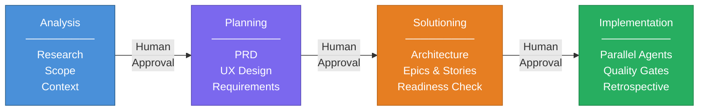
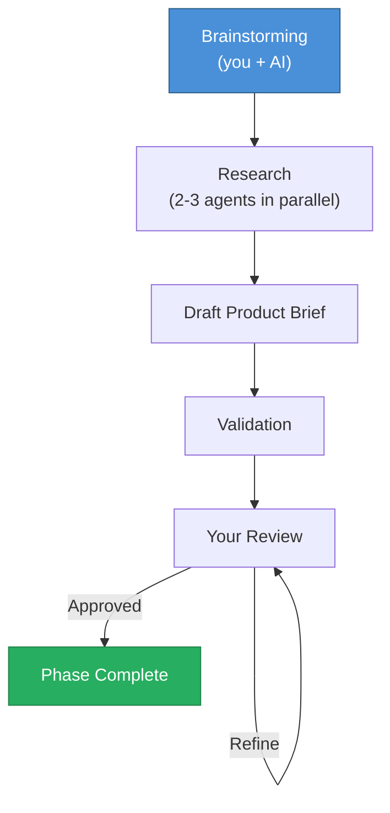
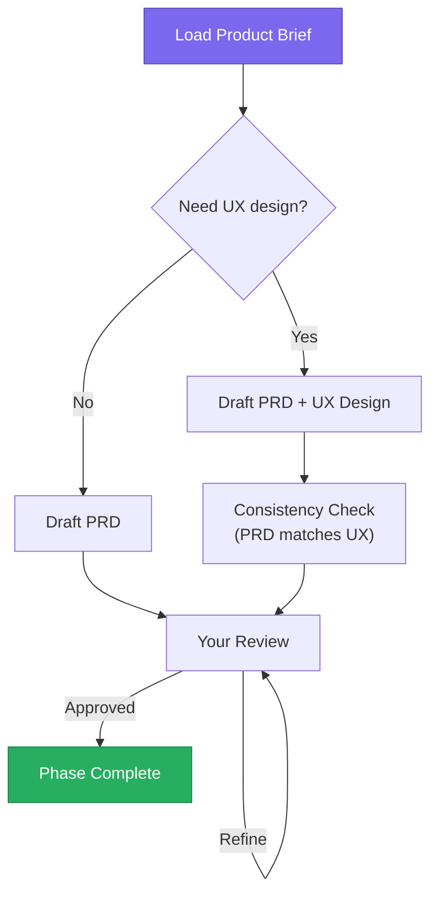
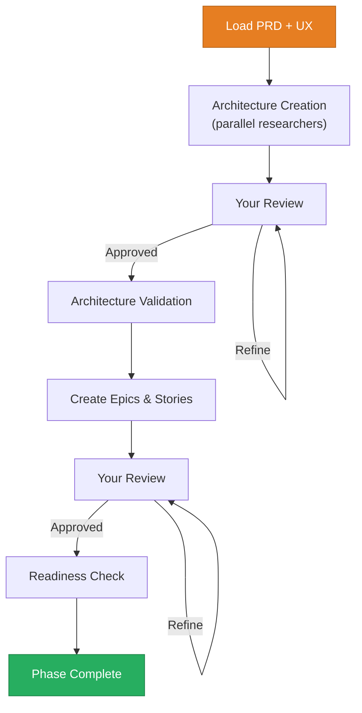
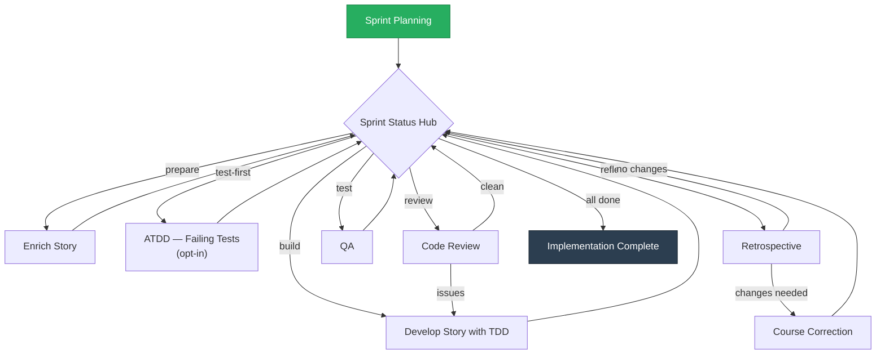

<p align="center">
  
</p>

<h1 align="center">CodeMAD</h1>

<p align="center">
  <strong>The AI coding platform where methodology beats speed.</strong><br />
  A structured 4-phase protocol that turns ideas into working software -- without the spaghetti.
</p>

<p align="center">
  <a href="LICENSE"></a>
  
  
</p>

---

## The Problem

AI coding tools are everywhere. They generate code fast. And the results are getting worse.

- **1.7x more issues** in AI-generated code compared to human-written code
- **2.74x more security vulnerabilities** introduced by AI assistants
- **PRs are 150% larger** with a 9% rise in bugs
- Developer trust in AI tools **dropped from 43% to 33%** in one year
- Experienced developers were **19% slower** when using AI tools in controlled trials

The industry generates code faster but ships products slower. Every tool accelerates the same thing: raw code output. None of them ask the question that matters: **is this the right code to write?**

## The Solution

CodeMAD takes a different approach. Instead of typing faster, it thinks first.

A 4-phase protocol guides every task from idea to working code: Analysis, Planning, Solutioning, Implementation. Each phase produces one clear output document. You review and approve before the next phase begins.

> **The protocol IS the product. Everything else is infrastructure to deliver it.**



Two tracks handle different workloads:

| Track | When to Use | What Happens |
|-------|------------|-------------|
| **Full Protocol** | New projects, major features | All 4 phases with human decision gates |
| **Quick Flow** | Bug fixes, small changes | Skip to spec + build (v0.1-beta) |

---

## Why CodeMAD?

### 1. Structured Methodology

No competitor ships a full methodology pipeline. CodeMAD's 4-phase protocol structures every task from discovery through delivery. The result: predictable, maintainable output instead of code that needs immediate refactoring.

### 2. Privacy First

Your code stays on your machine. Direct API calls using your own keys. No proxy servers. No telemetry. No data leaves your environment. Your projects, memory, and search indices live in local storage.

### 3. Provider Freedom

**OAuth-first.** If you already pay for ChatGPT Plus, Claude Pro, or Gemini Advanced, you can use CodeMAD at zero extra cost. Log in with your existing account and go. BYOK (Bring Your Own Key) ships later as a power-user alternative for direct API control.

| Priority | Provider | Auth | Target |
|----------|----------|------|--------|
| 1 | OpenAI (GPT / o-series) | OAuth | v0.1-alpha |
| 2 | Anthropic (Claude family) | OAuth | v0.1-beta |
| 3 | Google (Gemini family) | OAuth | v0.1-beta |
| 4 | All providers | BYOK | v0.1-rc |
| 5 | Zhipu (GLM-4), Moonshot (Kimi) | OAuth / BYOK | v0.3 |

Local model support via Ollama is planned for v0.2.1 (true offline, full privacy).

### 4. The Triple Value of the Protocol

The protocol is not just a product feature. It serves three purposes at once:

- **Product differentiator** -- the only platform with an integrated methodology pipeline
- **Legal defence** -- human authorship gates at each phase create "substantial human participation" evidence, the strongest position for AI code copyright
- **Regulatory compliance** -- phase-by-phase documentation of human vs AI contributions satisfies EU AI Act transparency requirements (deadline: August 2, 2026)

---

## How It Works

### Starting a Project

CodeMAD detects whether you are starting fresh or working with existing code.

| Scenario | What Happens |
|----------|-------------|
| **Greenfield** (empty directory) | Start at Phase 1. Full protocol from scratch. |
| **Brownfield** (existing codebase) | CodeMAD scans the project first, generates a context document, then enters the protocol. |
| **Returning** | The app resumes where you left off. No re-scan needed. |

For brownfield projects, the scan extracts tech stack, architecture patterns, API contracts, code conventions, and integration points. You review the scan results before the protocol begins.

### Phase 1: Analysis

**Goal:** Transform a vague idea into a validated Product Brief.

The app enters analyst mode. It asks questions, challenges assumptions, and guides you through structured exploration. It does not generate solutions. It draws solutions out of you.



- **Brainstorming is always interactive.** The AI facilitates, but you drive the direction.
- **Research runs automatically.** Market, domain, and technical researchers work in parallel after brainstorming captures your intent.
- **Intermediate artifacts are temporary.** Brainstorming notes and research documents feed the Product Brief, then get deleted. The brief is the single output.

### Phase 2: Planning

**Goal:** Transform the Product Brief into implementation-ready requirements and (optionally) a UX design.

The app enters product manager mode. It pushes for specificity: "what happens when the user clicks this button?" rather than "the user can manage their settings."



- **PRD before UX by default.** The UX designer references PRD requirements so every interaction maps to a requirement.
- **Consistency checking is automatic.** Every button in the UX must map to a requirement. Every user flow in the PRD must have a matching design.
- **UX is optional.** CLIs, libraries, and APIs skip this step.

### Phase 3: Solutioning

**Goal:** Transform the PRD and UX Design into an architecture document and implementable epics with stories.

The app enters architect mode. It is research-heavy, opinionated about patterns, and focused on decisions that will survive implementation.



- **Epics split by user value, not technical layer.** "User Authentication" is correct. "Database Setup" is wrong. Each epic delivers complete end-to-end functionality.
- **Stories use BDD acceptance criteria.** Every story has Given/When/Then criteria that are independently testable.
- **The readiness check is the final gate.** It validates the entire chain from Product Brief to PRD to Architecture to Epics. Any broken link is caught before implementation begins.

### Phase 4: Implementation

**Goal:** Build working code from the validated architecture and stories through a managed sprint cycle.

The app enters team lead mode. It coordinates Story Developer agents but does not write code directly. It follows the architecture document exactly. When changes are needed, it routes corrections to the right specialist.



**How stories move through the system:**

```
backlog --> ready-for-dev --> in-progress --> review --> done
```

- **Sprint Status is the routing hub.** It reads current state and decides what happens next. A code review can send a story back to development. A retrospective can trigger course corrections.
- **Multiple stories build in parallel.** Up to 3 Story Developer agents work at the same time (configurable), each in an isolated git worktree. Your main branch stays untouched until you approve the merge.
- **Every story uses TDD.** Red (write failing tests), Green (make them pass), Refactor (improve while keeping tests green). No shortcuts.
- **Three testing strategies.** Standard TDD (default) writes tests during implementation. ATDD (opt-in) generates failing acceptance tests before the dev agent starts. Post-implementation (opt-in) expands coverage after code is written. You choose per project or per epic.
- **Code review is adversarial.** A different AI model reviews the code, cross-references it against the story's acceptance criteria, and is expected to surface at least 3 issues. Tasks marked done but not actually implemented are flagged as critical.
- **Course correction follows real-team delegation.** Story Developer agents never edit planning documents. When implementation reveals a flaw, the issue is routed to the right specialist: architecture issues go to the architect, story issues go to the product manager.

### Your Review Checkpoints

After each major document is created, you choose how to proceed:

| Choice | What Happens | When to Use |
|--------|-------------|-------------|
| **Continue** | Accept the document. Move to validation. | It looks complete. |
| **Party Mode** | Creative exploration. Suggests additions and "what if" scenarios. | The document feels thin. |
| **Advanced Elicitation** | Structured probing questions to find gaps. | You suspect unstated assumptions. |
| **YOLO** | Auto-complete without pausing. Not available in Phase 4. | You trust the output and want speed. |

You can loop through Party Mode or Advanced Elicitation as many times as needed. Continue exits the loop.

### Validation and Self-Repair

Every phase runs automatic validation before it completes. When the validator finds issues:

| Severity | What Happens |
|----------|-------------|
| **Critical** | Must fix. Auto-repair runs (max 2 attempts), then escalates to you if unresolved. |
| **Major** | Should fix. Same auto-repair loop. |
| **Minor** | Logged but does not block progress. |

You cannot advance to the next phase until validation passes (or you choose to override).

### Quick Flow

Not every task needs the full protocol. Quick Flow is for bug fixes and small changes to existing projects.

1. You describe the change in natural language.
2. A single agent generates a mini-spec, implements the code, and runs quality checks.
3. If the change affects more than 3 files or 2 modules, the app suggests switching to the full protocol.

Quick Flow runs in a separate free chat interface, outside the protocol tabs.

---

## Quality Gates

Five gates run in cost order. The cheapest checks run first so failures are caught before expensive operations.

| Gate | Checks | Fails When |
|------|--------|-----------|
| 1. Lint | Style rules, imports, formatting | Violations, unused imports |
| 2. Type Check | Strict mode | Type errors, missing null checks |
| 3. Build | Full build | Bundling failures, circular deps |
| 4. Tests | All packages | Failing tests, coverage below threshold |
| 5. Review | Code reviewer agent (or human) | Unresolved change requests |

Agents cannot report "done" if any gate fails.

---

## Competitive Landscape

| Capability | CodeMAD | Cursor | Aider | Claude Code | Windsurf | Continue | Roo Code |
|-----------|---------|--------|-------|-------------|----------|----------|----------|
| Structured workflow | 4-phase protocol | No | No | No | No | No | No |
| Multi-agent worktrees | Git-isolated | No | No | Sub-agents | No | No | No |
| OAuth (use existing sub) | Yes (OpenAI, Anthropic, Google) | No | No | No | No | No | No |
| Automatic code indexing | Yes | Yes | Repo map | Manual | Yes | Yes | Yes |
| Goal-backward verification | CodeMAD Protocol | No | No | No | No | No | No |
| Chinese LLM support | Zhipu, Moonshot (v0.3) | No | No | No | No | No | No |
| Privacy (direct API) | Yes | No (proxy) | Yes | Yes | No (proxy) | Yes | Yes |
| Open source | AGPL-3.0 | Proprietary | Apache | Proprietary | Proprietary | Apache | Apache |
| Cost transparency | Per-task tracking | No | No | No | No | No | No |
| Local model support | Planned (Ollama, v0.2.1) | No | Yes | No | No | Yes | Yes |

---

## Roadmap

Six stable checkpoints from shell to MVP, then a longer road to v1.0.

| Release | What Ships |
|---------|-----------|
| **v0.1-alpha** | Desktop shell. OpenAI OAuth. Single-agent 4-phase protocol. Basic quality gates. |
| **v0.1-beta** | + Anthropic/Google OAuth. Cross-session memory. Quick Flow. |
| **v0.1-rc** | + BYOK all providers. Model selection. Two-track UI (protocol chat + free chat). |
| **v0.2 (MVP)** | + Multi-agent with git worktree isolation. Agent coordination. Failure recovery. AI-powered merge. |
| **v0.2.1** | + Ollama local models. Rate limiting. Token usage tracking. |
| **v0.2.2** | + EU AI Act compliance. Network resilience. Error UX. Credential rotation. |
| **v0.3+** | Zhipu/Moonshot providers. Kanban dashboard. Auto model router. Visual brainstorming. |

### Current Status

CodeMAD is in the **planning phase**. Brainstorming, technical research, domain research, product brief, and PRD are complete. Architecture design is next. No application code exists yet.

**Research completed:**
- 116 questions explored across 5 thematic clusters
- 12 technology decisions locked with full rationale
- 50+ sources across technical, market, and domain research
- Product brief and PRD validated and locked

---

## Key Features (Planned)

| Feature | Description |
|---------|-------------|
| **Four-Phase Protocol** | Analysis, Planning, Solutioning, Implementation. Human decision gate at each transition. |
| **Two-Track Workflow** | Full Protocol for new projects. Quick Flow for bug fixes and small changes. |
| **Parallel Execution** | Multiple agents build stories at the same time in isolated git worktrees. |
| **Self-Validating QA** | Builder-validator pattern and quality gates catch issues before you review. |
| **AI-Powered Merge** | Automatic conflict resolution when integrating worktrees back to main. |
| **Cross-Session Memory** | The platform remembers decisions, patterns, and project context between sessions. |
| **Pre-flight Checklist** | Visual readiness gate (green/yellow/red) before each phase transition. |
| **Pre-Installed Intelligence** | Real-time library docs and security scanning run automatically. No setup needed. |
| **OAuth-First Auth** | Log in with your existing ChatGPT Plus, Claude Pro, or Gemini Advanced subscription. |
| **Extensibility** | Connect external tools. Tools load on-demand to save context. |
| **Cross-Platform** | Native desktop apps for macOS, Windows, and Linux. |

---

## The Market Opportunity

The AI coding tools market is in a "Warring States Period" ([a16z](https://a16z.com)):

- **$7.4B market** growing at 15-27% CAGR
- **82% of developers** use AI assistants daily or weekly
- **Cursor reached $500M ARR** in 15 months
- **42% of developers** run models locally
- **Zero competitors** offer a structured methodology pipeline

The gap is validated. The timing is now.

---

## Contributing

CodeMAD is in stealth development. The repository is not accepting contributions yet.

Once the project reaches beta, contribution guidelines will be published. Watch or star the repo to get notified.

## License

CodeMAD is licensed under the [GNU Affero General Public License v3.0](LICENSE).

This means: forks and modifications must remain open source. If you run a modified version as a service, you must release the source. See the `LICENSE` file for full terms.

---

<p align="center">
  
  <br />
  <em>Built with methodology. Not just speed.</em>
</p>
