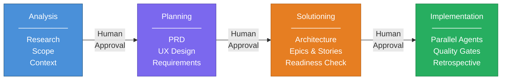
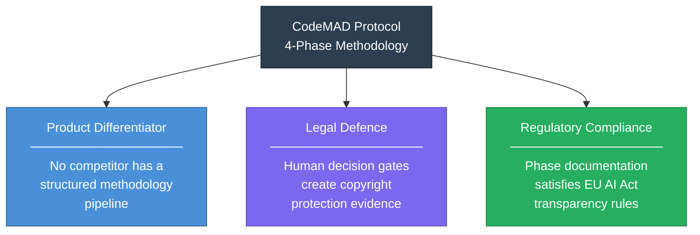
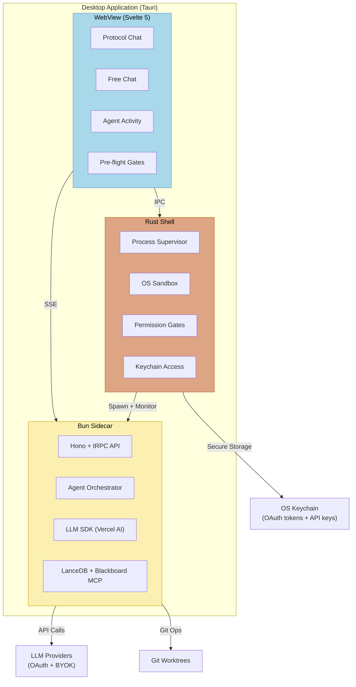
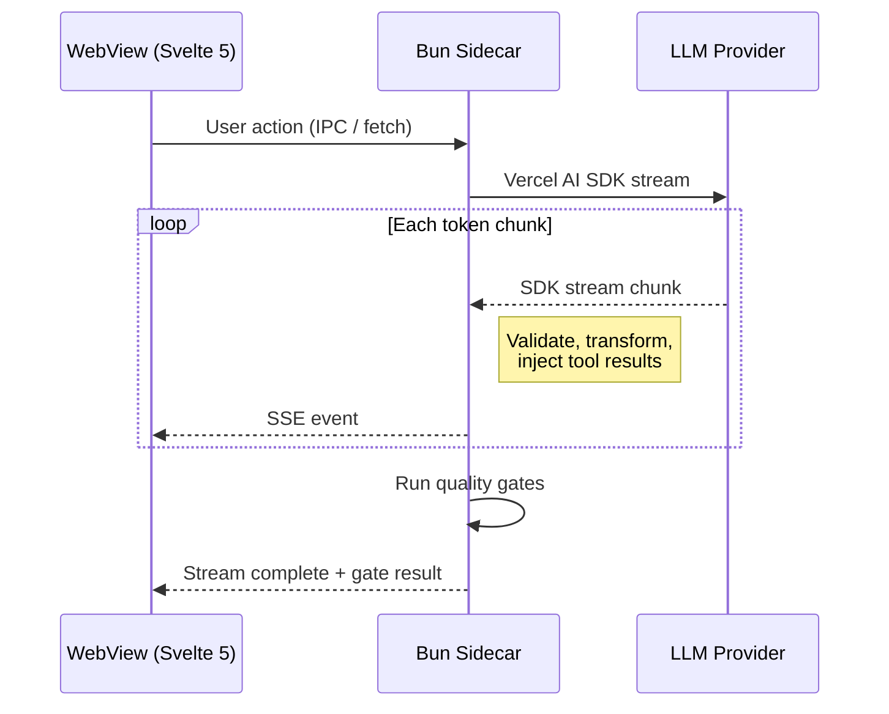
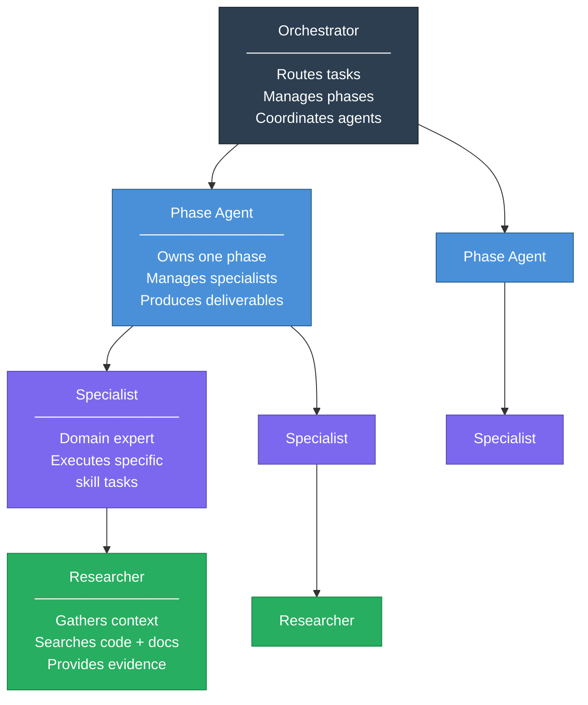
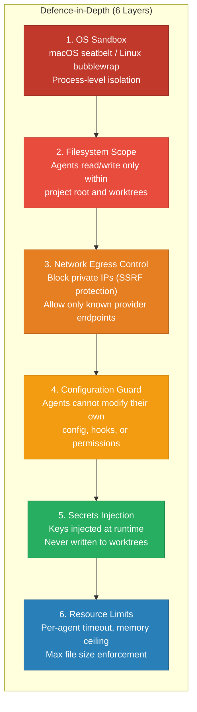

<p align="center">
  
</p>

<h1 align="center">CodeMAD</h1>

<p align="center">
  <strong>The AI coding platform where methodology beats speed.</strong><br />
  A structured 4-phase protocol that turns ideas into working software -- without the spaghetti.
</p>

<p align="center">
  <a href="LICENSE"></a>
  
  
</p>

---

## The Problem

AI coding tools are everywhere. They generate code fast. And the results are getting worse.

- **1.7x more issues** in AI-generated code compared to human-written code
- **2.74x more security vulnerabilities** introduced by AI assistants
- **PR sizes up 150%** with a 9% rise in bugs
- Developer trust in AI tools **dropped from 43% to 33%** in one year
- Experienced developers were **19% slower** when using AI tools in controlled trials

The industry generates code faster but ships products slower. Every tool accelerates the same thing: raw code output. None of them ask the question that matters: **is this the right code to write?**

## The Solution

CodeMAD takes a different approach. Instead of typing faster, it thinks first.

A 4-phase protocol guides every task from idea to working code: Analysis, Planning, Solutioning, Implementation. Multi-agent orchestration runs the phases in parallel while you stay in control. Each phase has a human decision gate. You approve before the next phase begins.

> **The protocol IS the product. Everything else is infrastructure to deliver it.**



Two tracks handle different workloads:

| Track | When to Use | What Happens |
|-------|------------|-------------|
| **Full Protocol** | New projects, major features | All 4 phases with human decision gates |
| **Quick Flow** | Bug fixes, small changes | Skip to spec + build (v0.1-beta) |

---

## Why CodeMAD?

### 1. Structured Methodology

No competitor ships a full methodology pipeline. CodeMAD's 4-phase protocol (Analysis, Planning, Solutioning, Implementation) guides every task from discovery through delivery. The result: predictable, maintainable output instead of code that needs immediate refactoring.

### 2. Privacy First

Your code stays on your machine. Direct API calls to your own keys (BYOK). No proxy servers. No telemetry. No data leaves your environment. Desktop-native architecture means your projects, memory, and search indices live in local storage.

### 3. Multi-Agent Orchestration

Multiple Story Developer agents build in parallel (up to 3 by default, configurable), each implementing one story end-to-end as a vertical slice (backend + frontend + tests) in an isolated git worktree. Faster through parallelism. Safer through isolation. Your main branch stays untouched until you approve the merge.

### 4. Context Intelligence

Three-layer memory architecture: cross-session memory (LanceDB) stores decisions, patterns, and project context. Within-session memory (Blackboard MCP) gives agents shared state. Inter-agent coordination uses task lists and blackboard events. Unified semantic search across code and memory. AST-aware vector search understands code structure. Lessons from previous projects inform future decisions automatically.

### 5. Provider Freedom

**OAuth-first.** If you already pay for ChatGPT Plus, Claude Pro, or Gemini Advanced, you can use CodeMAD at zero extra cost. Log in with your existing account and go. BYOK (Bring Your Own Key) ships later as a power-user alternative for direct API control.

| Priority | Provider | Auth | Target |
|----------|----------|------|--------|
| 1 | OpenAI (GPT / o-series) | OAuth | v0.1-alpha |
| 2 | Anthropic (Claude family) | OAuth | v0.1-beta |
| 3 | Google (Gemini family) | OAuth | v0.1-beta |
| 4 | All providers | BYOK | v0.1-rc |
| 5 | Zhipu (GLM-4), Moonshot (Kimi) | OAuth / BYOK | v0.3 |

Local model support via Ollama is planned for v0.2.1 (true offline, full privacy). Manual model selection per chat ships first. An automatic model router arrives in v0.4 as an optional feature.

### 6. The Triple Value of the Protocol

The protocol is not just a product feature. It serves three purposes simultaneously:



- **Product differentiator** -- the only platform with an integrated methodology pipeline
- **Legal defence** -- human authorship gates at each phase create "substantial human participation" evidence, the strongest position for AI code copyright
- **Regulatory compliance** -- phase-by-phase documentation of human vs AI contributions satisfies EU AI Act transparency requirements (deadline: August 2, 2026)

---

## Architecture

CodeMAD is a desktop application built on a three-layer architecture. Rust handles security and process management. Bun handles business logic and LLM communication. The WebView renders the interface.



**Why this split?** Rust provides security guarantees that TypeScript cannot: process isolation, filesystem sandboxing, and memory safety. Bun provides fast startup and native integration with the JavaScript ecosystem where LLM SDKs live. The WebView delivers a rich UI without the overhead of Electron.

### Double Streaming

LLM responses flow through two hops: provider to sidecar (SDK stream), then sidecar to frontend (Server-Sent Events). This gives the backend a chance to intercept, validate, and transform agent output before the user sees it.



---

## Agent System

Four tiers of agents handle work at different levels of abstraction. Higher tiers coordinate. Lower tiers execute.



- **MCP tools load on-demand** to keep context clean.
- **Blackboard pattern** for agent coordination: agents post findings to a shared state that others can read. 13-57% improvement over master-slave messaging.
- **Narrative casting** for phase handoffs: structured summaries prevent hallucination when passing context between agents.

### Permission Modes

Three levels control how much autonomy agents have:

| Mode | File Edits | Terminal Commands | Sandbox |
|------|-----------|-------------------|---------|
| **Guardian** | Ask every time | Ask every time | Always enforced |
| **Balanced** | Auto-approve | Ask every time | Always enforced |
| **Autopilot** | Auto-approve | Auto-approve | Always enforced |

The sandbox boundary is always enforced. Balanced mode reduces approval prompts by ~84%.

---

## Security

Six independent layers. A breach in one does not compromise the others.



---

## Quality Gates

Five gates run in cost order. The cheapest checks run first so failures are caught before expensive operations.

| Gate | Checks | Fails When |
|------|--------|-----------|
| 1. Lint | Style rules, imports, formatting | Violations, unused imports |
| 2. Type Check | `tsc --noEmit` strict mode | Type errors, missing null checks |
| 3. Build | Turborepo full build | Bundling failures, circular deps |
| 4. Tests | All packages | Failing tests, coverage below threshold |
| 5. Review | Code reviewer agent (or human) | Unresolved change requests |

Agents cannot report "done" if any gate fails. Stop hooks with exit code 2 force continuation until all gates pass.

---

## Competitive Landscape

| Capability | CodeMAD | Cursor | Aider | Claude Code | Windsurf | Continue | Roo Code |
|-----------|---------|--------|-------|-------------|----------|----------|----------|
| Structured workflow | 4-phase protocol | No | No | No | No | No | No |
| Multi-agent worktrees | Git-isolated | No | No | Sub-agents | No | No | No |
| OAuth (use existing sub) | Yes (OpenAI, Anthropic, Google) | No | No | No | No | No | No |
| Automatic code indexing | LanceDB + AST | Yes | Repo map | Manual | Yes | Yes | Yes |
| Goal-backward verification | CodeMAD Protocol | No | No | No | No | No | No |
| Chinese LLM support | Zhipu, Moonshot (v0.3) | No | No | No | No | No | No |
| Privacy (direct API) | Yes | No (proxy) | Yes | Yes | No (proxy) | Yes | Yes |
| Open source | AGPL-3.0 | Proprietary | Apache | Proprietary | Proprietary | Apache | Apache |
| Cost transparency | Per-task tracking | No | No | No | No | No | No |
| Local model support | Planned (Ollama, v0.2.1) | No | Yes | No | No | Yes | Yes |

---

## Tech Stack

| Layer | Technology | Why |
|-------|-----------|-----|
| Desktop shell | Tauri (Rust) | Security, small binary, native performance |
| Runtime | Bun | Fast startup, Anthropic-validated (Claude Code sidecar) |
| Frontend | Svelte 5 | 30-40% less code, native SSE, small bundles |
| API | Hono + tRPC | Type-safe end-to-end, lightweight |
| LLM integration | Vercel AI SDK v6 | Unified streaming across all providers |
| Vector DB | LanceDB | Dual-use: code search + cross-session memory |
| Agent coordination | Blackboard MCP | Shared state, lazy tool loading |
| Monorepo | pnpm + Turborepo | Fast builds, package isolation |
| Linting | Biome | Fast, single tool for format + lint |
| Testing | Vitest + cargo test | JS + Rust coverage in one pipeline |

These 12 decisions were locked after extensive research in February 2026. Full rationale with trade-off analysis is documented in the planning artifacts.

---

## Roadmap

Six stable checkpoints from shell to MVP, then a longer road to v1.0 and beyond.

| Release | What Ships | Proves |
|---------|-----------|--------|
| **v0.1-alpha** | Desktop shell (Tauri + Bun + Svelte 5). OpenAI OAuth. Single-agent 4-phase protocol. Basic quality gates. Code signing. Permission modes. | Protocol works end-to-end. App distributable. |
| **v0.1-beta** | + Anthropic/Google OAuth. Cross-session memory (LanceDB). Pre-flight checklist. Quick Flow. Auto-update. | Multi-provider OAuth. Protocol has memory. |
| **v0.1-rc** | + BYOK all providers. Manual model selection. Two-track UI (protocol chat + free chat). | Power users can join. Full UI experience. |
| **v0.2 (MVP)** | + Multi-agent with git worktree isolation. Agent communication (task list + blackboard). Agent failure recovery. AI-powered merge. Language-aware quality gates. | Protocol scales. Parallel execution proven. |
| **v0.2.1** | + Ollama local models. Rate limiting. Token usage tracking. | True offline AI. Cost-conscious users can join. |
| **v0.2.2** | + EU AI Act compliance. Network resilience. Error UX. Credential rotation. | Regulatory compliant. Production-grade error handling. |
| **v0.3+** | Zhipu/Moonshot providers. Kanban dashboard. Auto model router. Visual brainstorming. And more through v2.0. | Ecosystem expansion. Platform maturity. |

### Current Status

CodeMAD is in the **PRD creation phase**. Brainstorming, technical research, domain research, and the product brief are complete. PRD creation is next, then architecture. No application code exists yet.

**What exists today:**

```
_bmad-output/
  brainstorming/                           # Product spec and 4-technique brainstorming session
  planning-artifacts/
    product-brief-CodeMAD-2026-02-10.md    # Validated product brief
    notes/Architecture/                    # Phase orchestration design notes
    research/                              # Technical, market, domain research (3 sharded docs)
      BMAD-METHODOLOGY-REFERENCE.md        # Full BMAD methodology reference
  implementation-artifacts/                # Empty (not started)
assets/                                    # Logo SVGs, banner, icon generation scripts
```

**Research completed:**
- 116 questions explored across 5 thematic clusters
- 20 SCAMPER transformation ideas accepted
- 6 chaos engineering attack vectors stress-tested
- 12 technology decisions locked with full rationale
- 50+ sources across technical, market, and domain research
- 31 architecture gaps identified and prioritised
- BMAD deep research complete (11 parallel agents, 483+ files analysed)
- Domain research complete (26 web searches, 50+ sources)
- Product brief validated and locked

---

## Key Features (Planned)

| Feature | Description |
|---------|-------------|
| **Four-Phase Protocol** | Analysis, Planning, Solutioning, Implementation. Human decision gate at each transition. |
| **Two-Track Workflow** | Full Protocol for new projects. Quick Flow for bug fixes and small changes. One app, two modes. |
| **Parallel Execution** | Multiple Story Developer agents build simultaneously in isolated git worktrees. |
| **Self-Validating QA** | Builder-validator pattern and quality gates catch issues before you review. |
| **AI-Powered Merge** | Automatic conflict resolution when integrating worktrees back to main. |
| **Context Intelligence** | Three-layer memory: cross-session (LanceDB), within-session (Blackboard MCP), inter-agent (task list). |
| **Pre-flight Checklist** | Visual readiness gate (green/yellow/red) before each phase transition. |
| **Pre-Installed Intelligence** | Context7 (real-time library docs) and Semgrep (security scanning) run automatically. No setup needed. |
| **OAuth-First Auth** | Log in with your existing ChatGPT Plus, Claude Pro, or Gemini Advanced subscription. |
| **MCP Extensibility** | Connect any MCP server. Tools load on-demand to save context. |
| **Cross-Platform** | Native desktop apps for macOS, Windows, and Linux. |

---

## The Market Opportunity

The AI coding tools market is in a "Warring States Period" ([a16z](https://a16z.com)):

- **$7.4B market** growing at 15-27% CAGR
- **82% of developers** use AI assistants daily or weekly
- **Cursor reached $500M ARR** in 15 months
- **42% of developers** run models locally
- **Zero competitors** offer a structured methodology pipeline

The gap is validated. The timing is now.

---

## Contributing

CodeMAD is in stealth development. The repository is not accepting contributions yet.

Once the project reaches beta, contribution guidelines will be published. Watch or star the repo to get notified.

## License

CodeMAD is licensed under the [GNU Affero General Public License v3.0](LICENSE).

This means: forks and modifications must remain open source. If you run a modified version as a service, you must release the source. See the `LICENSE` file for full terms.

---

<p align="center">
  
  <br />
  <em>Built with methodology. Not just speed.</em>
</p>
