# Phase Orchestration Design

## Table of Contents

- [Purpose](#purpose)
- [Design Principles](#design-principles)
- [Severity-Based Verification](#severity-based-verification)
- [Information Flow](#information-flow)
- [Architecture: Why Per-Phase Orchestrators](#architecture-why-per-phase-orchestrators)
- [Project Onboarding](#project-onboarding)
- [Phase Overview](#phase-overview)
  - [Artifact Flow](#artifact-flow)
  - [The FR Contract Principle](#the-fr-contract-principle)
  - [Traceability Chain](#traceability-chain)
- [Phase 1: Analysis](#phase-1-analysis)
- [Phase 2: Planning](#phase-2-planning)
- [Phase 3: Solutioning](#phase-3-solutioning)
- [Phase 4: Implementation](#phase-4-implementation)
  - [Sprint Management](#sprint-management)
  - [Create Story Enrichment](#create-story-enrichment)
  - [Dev Story TDD](#dev-story-tdd)
  - [Code Review](#code-review)
  - [QA Automate](#qa-automate)
  - [Retrospective](#retrospective)
  - [Course Correction](#course-correction)
- [Agent Registry](#agent-registry)
- [Blackboard and Communication](#blackboard-and-communication)
- [Parallelism Opportunities](#parallelism-opportunities)
- [Interface Model: Protocol Chat + Free Chat](#interface-model-protocol-chat--free-chat)
- [Document Quality Standard](#document-quality-standard)
- [Document Review: A/P/C Checkpoint](#document-review-apc-checkpoint)
- [Phase Transition Protocol](#phase-transition-protocol)
- [Dynamic Phase Entry](#dynamic-phase-entry)
- [Controlled Evolution](#controlled-evolution)
- [Quick Flow](#quick-flow)
- [MCP Server Extension Point](#mcp-server-extension-point)
- [Cross-Phase Tools](#cross-phase-tools)
- [Implementation Considerations](#implementation-considerations)
- [Workflow Execution Patterns](#workflow-execution-patterns)
- [Testing Integration](#testing-integration)
- [Design Decisions Log](#design-decisions-log)

---

## Purpose

This document defines how CodeMAD's four protocol phases operate as independent orchestration surfaces, each with its own system prompt, sub-agents, and UI context. The goal is to maximise quality and parallelism while keeping the user experience focused: one phase at a time, one clear output per phase, and a clean separation between planning and implementation.

The core insight: each phase is not an "agent" but a **mode** the application enters. When the user clicks Phase 1, the entire application personality changes. The system prompt, the available sub-agents, the UI layout, and the expected output all shift to serve that phase's single purpose.

---

## Design Principles

1. **One phase, one output.** Each phase produces exactly one canonical document. Intermediate artifacts (brainstorming notes, research files) are working memory that gets consumed and deleted when the output is validated.

2. **Per-phase orchestration, not global orchestrator.** Each phase has its own orchestrator. There is no single orchestrator sitting above all four phases. This avoids a context window that tries to hold the entire project in memory.

3. **Single protocol interface with phase tabs, plus a free chat.** The user sees one interface with navigation buttons for each phase. Clicking a phase changes the system behaviour (orchestrator, sub-agents, personality). A separate free chat exists for users who want unstructured AI assistance without the protocol.

4. **Sub-agents do the heavy work. The phase orchestrator coordinates.** The orchestrator for each phase never writes the output document directly. It spawns sub-agents for research, drafting, and validation, then synthesises their results.

5. **Validation is mandatory and automatic.** Every phase output runs through a validation sub-agent before the phase completes. The user cannot advance to the next phase until validation passes.

6. **Intermediate artifacts are temporary.** Brainstorming notes, research documents, and draft versions exist only to feed the canonical output. Once the output is validated, intermediate artifacts are deleted automatically.

---

## Severity-Based Verification

All validation sub-agents (Brief Validator, PRD Validator, Architecture Validator, Readiness Checker, Story Validator, Code Reviewer) use the same severity classification and auto-repair pattern. This section defines the model referenced by all four phases.

### Severity Classification

| Severity | Definition | Action |
|----------|-----------|--------|
| **Critical** | Blocks downstream work. Missing FR coverage, broken traceability, security vulnerability, architecture contradiction. | Must fix. Auto-repair loop. |
| **Major** | Degrades quality but does not block. Incomplete acceptance criteria, unclear story boundaries, suboptimal patterns. | Should fix. Auto-repair loop. |
| **Minor** | Cosmetic or stylistic. Naming inconsistencies, formatting, documentation gaps. | Logged. Does not block progression. |

### Auto-Repair Loop

When a validator finds Critical or Major issues:

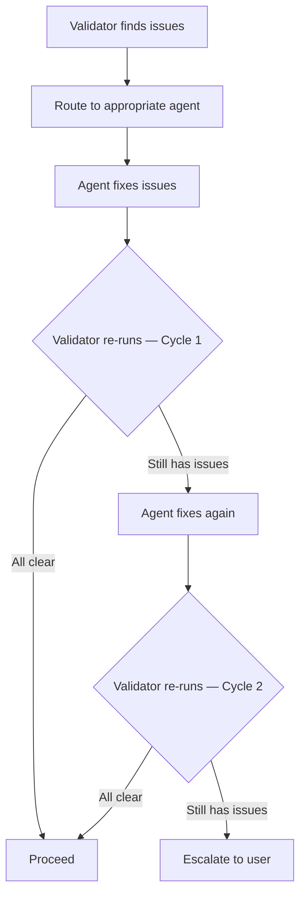

**Maximum 2 auto-repair cycles.** After the second failure, the orchestrator escalates to the user with a summary of what failed and why. Minor issues never trigger auto-repair.

**Phase-specific mapping:** The Implementation Readiness Check (Phase 3) uses verdict labels (READY/NEEDS WORK/NOT READY) that map to this model. NEEDS WORK triggers the auto-repair loop. NOT READY triggers immediate user escalation.

---

## Information Flow

### Current Constraint

Current LLM agent frameworks do not support direct sub-agent-to-sub-agent communication. All coordination flows through the orchestrator. This is a technical limitation, not a design choice. The architecture should be ready to allow direct sub-agent communication when frameworks support it.

### Orchestrator-Mediated Communication

This pattern applies to all phases. Every phase orchestrator mediates between its inputs and its sub-agents. Sub-agents receive focused instructions, not raw context dumps.

```text
User <-> Orchestrator <-> Sub-Agent
         |                   |
         |  1. Structured brief: goal, context file paths,
         |     scope, expected output format
         |  ---------------------------------->
         |
         |  2. Sub-agent reads files from disk, does work
         |
         |  3. Return: summary, output document path, status
         |  <----------------------------------
         |
         |  4. Orchestrator reads output document if needed
         |  5. Orchestrator decides next action
         |  6. Orchestrator presents summary to user in chat
```

Automatic validation sub-agents (consistency check, architecture verification, readiness check) return reports to the orchestrator. The orchestrator decides whether to show the report to the user or handle it automatically.

---

## Architecture: Why Per-Phase Orchestrators

The original four-tier hierarchy (Orchestrator > Phase > Specialist > Researcher) assumed a global orchestrator coordinating all phases. This design replaces the global orchestrator with per-phase orchestrators for three reasons.

**Reason 1: Context window budget.** A global orchestrator must hold awareness of all four phases, all artifacts, and all agent states. That exceeds the 120k soft target and forces aggressive compression. A per-phase orchestrator only needs to know its own phase's context: the input document(s) and the output being produced.

**Reason 2: No nested sub-agents.** Current LLM agent frameworks (Claude Code included) do not support sub-agents that themselves spawn sub-agents. A global orchestrator spawning a phase agent that spawns a researcher is three levels deep. Per-phase orchestrators flatten this to two levels: orchestrator spawns sub-agents. This works today.

**Reason 3: Clean phase transitions.** When Phase 1 completes, its orchestrator shuts down and its context is released. Phase 2 starts fresh with only the validated output from Phase 1 as input. No context bleed between phases. No stale state. Each phase reads the previous phase's output document, not the previous phase's conversation history.

The trade-off: no global orchestrator means no single agent with awareness of the full project lifecycle. The application itself (the Bun sidecar) manages phase transitions, stores phase state, and enforces the phase sequence. The orchestration of the protocol is application logic, not agent logic.

---

## Project Onboarding

Before any phase begins, CodeMAD must understand what kind of project the user is starting. Onboarding determines the protocol path. Brownfield projects always generate `project-context.md` before any protocol phase begins, regardless of which phase they enter. This document captures the existing codebase's tech stack, architecture patterns, code conventions, and integration points. All subsequent phases consume it as a constraint set.

### Greenfield vs Brownfield Detection

On "New Project", the user points CodeMAD at a directory. The application inspects it:

```text
User clicks "New Project" → selects directory
    |
    v
[Directory Inspection] -- AUTOMATIC
    |
    +-- Empty or no recognisable source files → GREENFIELD
    |       Start at Phase 1. Full protocol.
    |
    +-- Recognisable codebase detected → BROWNFIELD
            Run codebase scan before Phase 1.
```

**Detection signals:** presence of `package.json`, `Cargo.toml`, `go.mod`, `.git/`, `src/` or `lib/` directories with source files. If any recognised project markers exist, the project is brownfield.

### Brownfield Onboarding: Document Project + Generate Project Context

Before the protocol begins, brownfield projects run a codebase understanding step. This produces `project-context.md` -- a reference document that all four phases consume.

```text
[Codebase Scan] -- AUTOMATIC (quick or deep, user chooses)
    |
    |   Extracts:
    |   - Tech stack (languages, frameworks, versions)
    |   - Architecture patterns (component structure, data flow)
    |   - API contracts (endpoints, data models, auth patterns)
    |   - Code conventions (naming, file structure, testing approach)
    |   - Integration points (external deps, configuration)
    |
    v
[Generate project-context.md] -- AUTOMATIC
    |
    v
[User Reviews] -- INTERACTIVE
    |               User confirms or corrects extracted conventions.
    |               This step catches scan misinterpretations.
    |
    v
[Protocol Begins] -- Phase 1 (or later, if Dynamic Phase Entry is enabled)
                      All phases reference project-context.md as a constraint.
```

**Scan levels:** Quick (configs, manifests, directory structure only) and Deep (reads critical directories per project type). Exhaustive scan ships at v0.1-beta.

### Re-Entry Flow

When the user opens an existing CodeMAD project, the application reads stored phase state from `.codemad/` and resumes at the last active phase. No re-scan, no re-onboarding. The user picks up where they left off.

### UI Notes

- Greenfield projects show an empty workspace with a prompt: "Describe your project idea to start Phase 1."
- Brownfield projects show the extracted `project-context.md` summary before Phase 1 begins, so the user can verify the scan captured the codebase correctly.
- The scan progress is visible in the UI (files scanned, conventions detected) to build trust that the tool understands the existing codebase.

---

## Phase Overview

| Phase | Name | Input | Output | Intermediate Artifacts | UI Surface |
|-------|------|-------|--------|----------------------|------------|
| 1 | Analysis | User's idea (+ project-context.md for brownfield) | Product Brief | Brainstorming notes, research documents | Protocol chat (Phase 1 tab) |
| 2 | Planning | Product Brief | PRD + UX Design (optional) | Draft PRD, draft UX, consistency reports | Protocol chat (Phase 2 tab) |
| 3 | Solutioning | PRD + UX Design | Architecture + Epics | Draft architecture, verification reports, readiness report | Protocol chat (Phase 3 tab) |
| 4 | Implementation | Architecture + Epics | Working code | Sprint status, story files, code review reports | Protocol chat (Phase 4 tab) |

### Artifact Flow

Each phase consumes the previous phase's canonical output and produces the next. No phase reads a predecessor's conversation history.

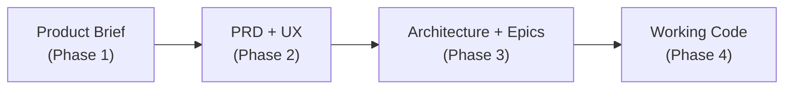

For brownfield projects, `project-context.md` flows as a supplementary input to every phase.

### The FR Contract Principle

The PRD's Functional Requirements are the capability contract for the entire project:

- **UX designers ONLY design what is in FRs.** If a capability is missing from FRs, no UI element exists for it.
- **Architects ONLY support what is in FRs.** Architecture decisions serve listed requirements, not hypothetical ones.
- **Epic breakdown ONLY implements what is in FRs.** Every epic and story traces back to one or more FRs.

If a capability is missing from FRs, it will not exist in the final product. This is deliberate. It forces completeness at the PRD stage and prevents scope creep during implementation.

### Traceability Chain

Every requirement must be traceable from origin to implementation:

```text
PRD FR ──> Epic ──> Story ──> Acceptance Criteria ──> Tests
```

The Implementation Readiness Check (Phase 3) validates this chain. Any FR without a story, or any story without acceptance criteria, fails the readiness check.

---

## Phase 1: Analysis

### Purpose

Transform a vague idea into a validated Product Brief.

### System Prompt Personality

The app enters **analyst mode**. The system prompt positions the AI as a strategic analyst and facilitator. It asks questions, challenges assumptions, and guides the user through structured exploration. It does not generate solutions. It draws solutions out of the user. The orchestrator acts as a gatekeeper, ensuring guardrails are followed and edge cases are explored before passing context to researcher sub-agents.

### Workflow

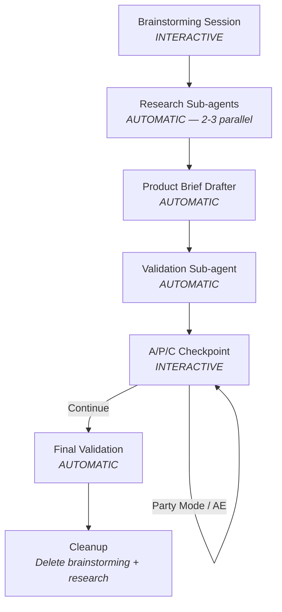

### Sub-Agent Roster

| Sub-Agent | Type | Spawned By | Purpose |
|-----------|------|-----------|---------|
| Brainstorming Facilitator | Phase Orchestrator itself | N/A | Runs the interactive brainstorming (this is the orchestrator's direct role) |
| Market Researcher | Researcher | Orchestrator | Investigate market size, competitors, trends |
| Domain Researcher | Researcher | Orchestrator | Investigate industry, regulatory, technical landscape |
| Technical Researcher | Researcher | Orchestrator | Evaluate tech stack options (only if needed) |
| Brief Drafter | Specialist | Orchestrator | Synthesise brainstorming + research into Product Brief |
| Brief Validator | Specialist | Orchestrator | Validate brief for completeness, consistency, coverage |

### Key Design Decisions

**Brainstorming is always interactive.** The user must participate. This is not a phase the AI can complete alone. The facilitation techniques (question storming, SCAMPER, chaos engineering) require human input to produce meaningful results. The first wow moment for the user is seeing their vague idea turn into a structured plan.

**Research is always automatic.** After brainstorming captures the user's intent, researcher sub-agents run in parallel without user input. The user watches researchers work (visible in the Phase 1 chat) but does not need to guide them.

**The system consumes and deletes intermediate artifacts.** The brainstorming notes and research documents exist solely to feed the Product Brief drafter. Once the Product Brief is validated, these files are removed. The Product Brief is the canonical output. If the user needs to revisit research findings, those findings are embedded in the brief itself.

**Validation checks for completeness against source material.** The validator does not just check the brief's internal consistency. It cross-references against the brainstorming session (were all key decisions captured?) and the research (were all findings incorporated?). This prevents the brief from silently dropping important discoveries.

---

## Phase 2: Planning

### Purpose

Transform the Product Brief into implementation-ready requirements and (optionally) a UX design.

### System Prompt Personality

The app enters **specification mode**. The system prompt positions the AI as a product manager. It is precise, detail-oriented, and focused on turning vision into measurable requirements. It pushes for specificity: "what happens when the user clicks this button?" rather than "the user can manage their settings." The orchestrator spawns a separate UX/UI Designer sub-agent for visual and interaction design.

### Workflow

**Path A: No UX design**

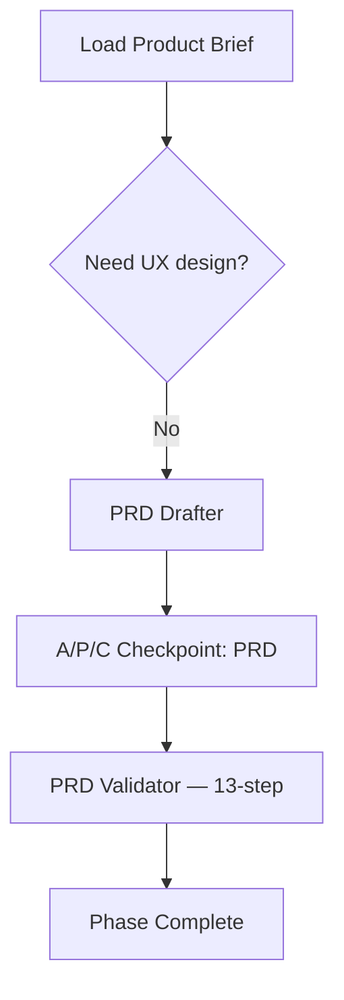

**Path B: With UX design**

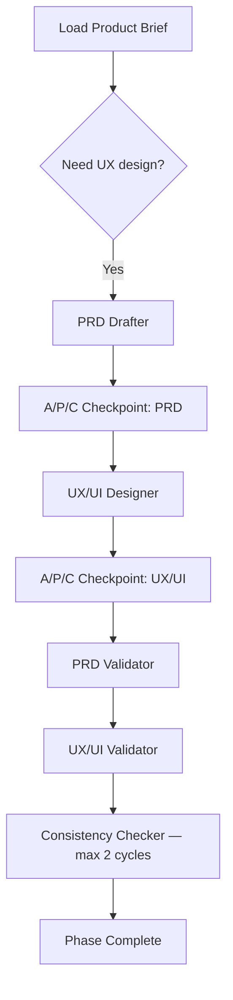

### Sub-Agent Roster

| Sub-Agent | Type | Spawned By | Purpose |
|-----------|------|-----------|---------|
| PRD Drafter | Specialist | Orchestrator | Create PRD from Product Brief |
| UX/UI Designer | Specialist | Orchestrator | Create UX and UI Design from Product Brief |
| PRD Validator | Specialist | Orchestrator | 13-step PRD validation |
| UX/UI Validator | Specialist | Orchestrator | UX/UI completeness and quality check |
| Consistency Checker | Specialist | Orchestrator | Cross-reference PRD against UX Design |

### Key Design Decisions

**PRD before UX by default.** The PRD is created first because the UX/UI Designer references PRD requirements to ensure every interaction maps to a requirement. Users can run them in parallel if they prefer, but sequential is the default because it produces better-aligned outputs.

**The consistency checker is the critical sub-agent.** The PRD and UX design must be perfectly aligned before Phase 3 begins. Every button described in the UX must map to a requirement in the PRD. Every user flow in the PRD must have a corresponding UX design. If the consistency check finds issues, the orchestrator routes fixes to the right sub-agent: PRD issues go to the PRD Drafter, UX issues go to the UX/UI Designer. After fixes, the consistency check re-runs automatically. Maximum 2 correction cycles -- after the second failure, the orchestrator escalates to the user for manual review.

**UX design is optional.** Not all projects need a UX design (CLIs, libraries, APIs). The user chooses. If skipped, only the PRD is produced and validated.

**No intermediate artifacts to delete.** Unlike Phase 1, the outputs of Phase 2 (PRD and UX Design) are both canonical and persist. There are no temporary working files to clean up.

---

## Phase 3: Solutioning

### Purpose

Transform the PRD and UX Design into an architecture document and implementable epics with stories.

### System Prompt Personality

The app enters **architect mode**. The system prompt positions the AI as a senior software architect. It is research-heavy, opinionated about patterns, and focused on making decisions that will survive implementation. Every technology choice, every pattern, every structural decision is backed by current research.

### Workflow

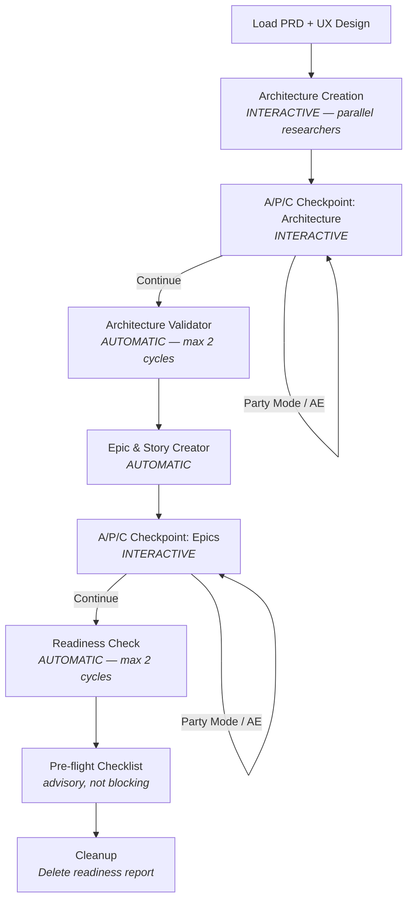

### Sub-Agent Roster

| Sub-Agent | Type | Spawned By | Purpose |
|-----------|------|-----------|---------|
| Tech Researcher | Researcher | Orchestrator | Current patterns, library versions, best practices |
| Security Researcher | Researcher | Orchestrator | OWASP, vulnerability patterns, SLSA compliance |
| Integration Researcher | Researcher | Orchestrator | API patterns, third-party service integration |
| Architecture Validator | Specialist | Orchestrator | Cross-reference architecture against PRD + UX |
| Epic Creator | Specialist | Orchestrator | Break architecture into implementable epics/stories |
| Readiness Checker | Specialist | Orchestrator | Final cross-artifact consistency validation |

### Epic Organisation Rules

Epics are organised by **user value** (vertical slices), never by technical layer. Each epic delivers complete end-to-end functionality for its domain.

**Correct epic structure:**
- Epic 1: User Authentication and Profiles (users can register, log in, manage profiles)
- Epic 2: Content Creation (users can create, edit, publish content)
- Epic 3: Social Interaction (users can follow, comment, react)

**Wrong epic structure:**
- Epic 1: Database Setup (no user value)
- Epic 2: API Development (no user value)
- Epic 3: Frontend Components (no user value)

**Story dependency rules:**
- Each epic must deliver complete functionality for its domain
- Epic N cannot require Epic N+1 to function
- Within an epic, Story N.2 can only depend on Story N.1 (never on N.3)
- Database tables are created only when a story needs them (never all upfront)

### BDD Acceptance Criteria Format

Every story must have acceptance criteria in Given/When/Then format:

```gherkin
Given {precondition}
When {action}
Then {expected outcome}
And {additional criteria}
```

Each acceptance criterion must be independently testable. A criterion that requires another criterion to be true first is a dependency, not an acceptance criterion.

### Readiness Check Classification

The Implementation Readiness Check produces one of three verdicts (follows the severity-based verification model):

| Verdict | Meaning | Action |
|---------|---------|--------|
| **READY** | All FRs traced to stories. All stories have BDD AC. Architecture supports all epics. No forward dependencies. | Proceed to Phase 4. |
| **NEEDS WORK** | Missing AC, unclear story boundaries, or incomplete FR coverage. | Route fixes to Architect or Epic Creator. Max 2 cycles. |
| **NOT READY** | Wrong epic organisation, circular dependencies, or significant FR gaps. | Escalate to user immediately. |

### Key Design Decisions

**Architecture creation is the most research-intensive step in the protocol.** This is where Context7 (real-time library docs) and Semgrep (security scanning) run automatically via MCP. The orchestrator spawns researchers in parallel to verify that every technology choice uses current APIs and patterns. Wrong decisions here cascade through every story and every file.

**Sprint planning stays in Phase 4 as its entry step.** The BMAD methodology places sprint planning at the start of Phase 4 because it reads the epics produced by Phase 3 and generates `sprint-status.yaml` -- the operational state file that drives the entire implementation cycle. Epic and story *creation* happens in Phase 3 (planning). Sprint *planning* (turning those stories into an actionable sprint backlog with status tracking) is the bridge between planning and building, and Phase 4 owns it.

**Architecture verification is automatic.** After the Architect finishes, the orchestrator spawns a validator to cross-reference the architecture against the PRD and UX. If verification fails, the orchestrator spawns the Architect with the verification report for corrections. Maximum 2 correction cycles -- after the second failure, the orchestrator escalates to the user.

**The readiness check is the final gate.** It validates the entire chain: Product Brief to PRD to UX to Architecture to Epics. If any link is broken (a requirement in the PRD has no story, a UX interaction has no architectural support), the readiness check catches it. If the readiness check fails, the orchestrator reads the report and routes fixes to the right sub-agent: architecture issues go to the Architect, epic/story issues go to the Epic Creator. If both are affected, the Architect runs first (because architecture changes affect stories), then the Epic Creator. After fixes, the readiness check re-runs automatically. Maximum 2 correction cycles -- after the second failure, the orchestrator escalates to the user.

---

## Phase 4: Implementation

### Purpose

Build working code from the validated architecture and stories through a managed sprint cycle.

### System Prompt Personality

The app enters **team lead mode**. The system prompt positions the AI as a senior team lead who coordinates Story Developers but does not write code directly. It is precise, disciplined, and focused on shipping code that passes quality gates. It follows the architecture document exactly. It does not make architectural decisions -- those were made in Phase 3. When architecture changes are needed, it spawns an Architect sub-agent rather than editing planning artifacts itself.

### UI Surface Change

**The Phase 4 tab has a different layout from Phases 1-3.** When the user clicks the Phase 4 tab, the chat panel remains but the surrounding UI changes: a sprint board shows story status (backlog, ready-for-dev, in-progress, review, done), agent activity streams show one per active worktree, and code diffs and quality gate results appear inline. The planning artifacts (Product Brief, PRD, UX Design, Architecture, Epics) are accessible in the sidebar as read-only references.

### Workflow

Phase 4 is a cycle, not a waterfall. Sprint Planning is the entry step. Sprint Status is the routing hub that directs work to the correct workflow.

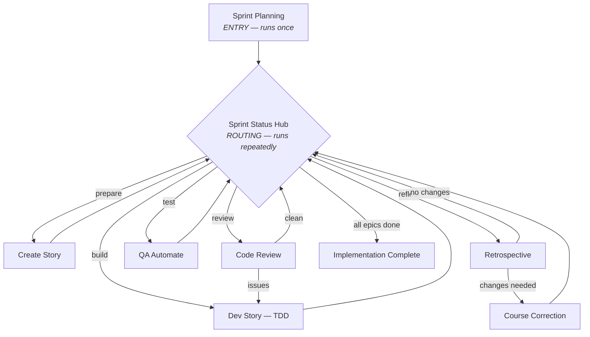

### Sprint Management

**`sprint-status.yaml` is the single source of truth** for all implementation progress. Every workflow in Phase 4 reads from it and writes to it.

**Story lifecycle:**

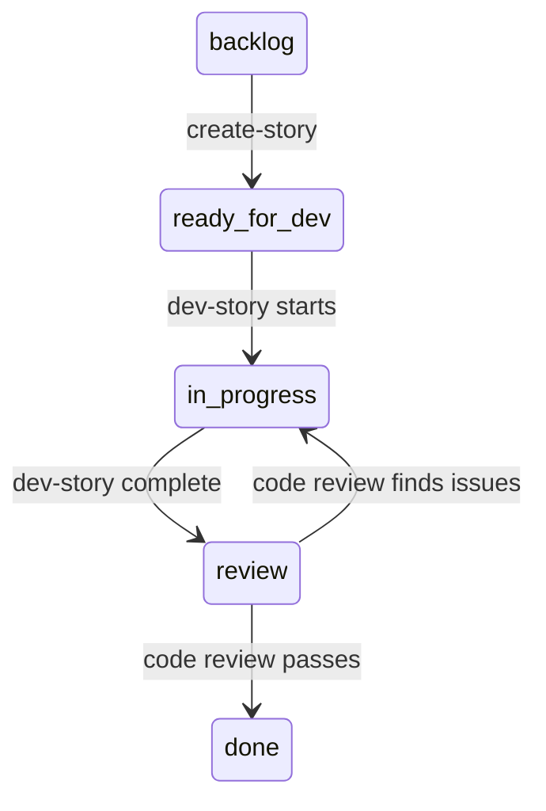

- `backlog` -- story exists in epics.md but has no enriched story file yet
- `ready-for-dev` -- create-story has produced a detailed story file
- `in-progress` -- dev-story agent is actively building
- `review` -- dev-story is complete, awaiting code review
- `done` -- code review passed, story merged

**Epic lifecycle:**

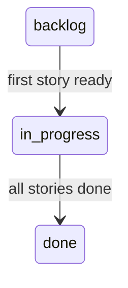

An epic moves to `in-progress` when its first story moves to `ready-for-dev`. An epic moves to `done` when all its stories are `done`.

**Sprint status data model concepts:**

```yaml
epics:
  - id: epic-1
    title: "User Authentication and Profiles"
    status: in-progress
    stories:
      - id: story-1.1
        title: "User registration"
        status: ready-for-dev
        story_file: "implementation-artifacts/story-1.1.md"
      - id: story-1.2
        title: "User login"
        status: backlog
retrospectives:
  - epic: epic-1
    status: optional
```

**Sprint board UI:** The Phase 4 interface shows a kanban-style board with columns matching the story lifecycle. Each card shows the story title, assigned agent (if any), and current quality gate status.

**Intelligent status detection:** If story files already exist on disk (from a previous session), sprint planning upgrades their status to at least `ready-for-dev`. It never downgrades existing statuses.

### Create Story Enrichment

Create Story takes ONE story from `epics.md` and produces a comprehensive, self-contained dev guide.

**6-step overview:**

| Step | Purpose |
|------|---------|
| 1 | Determine target story (from sprint-status or user input) |
| 2 | Exhaustive artifact analysis (epics, PRD, architecture, UX, previous stories, git history) |
| 3 | Architecture analysis for developer guardrails (9 categories) |
| 4 | Web research for latest library versions and breaking changes |
| 5 | Create comprehensive story file (populate BMAD template) |
| 6 | Update sprint-status.yaml to `ready-for-dev` |

**Previous story intelligence (Step 2):** When enriching story N.2, the agent reads story N.1's dev agent record, extracting: dev notes, review feedback, files modified, testing approaches used, and problems encountered. This prevents repeating mistakes and ensures consistency across stories within an epic.

**Disaster prevention gap analysis:** After the story file is drafted, a checklist runs across 5 categories: reinvention prevention, technical specification, file structure, regression, and implementation disasters.

**Output:** `{implementation_artifacts}/{story-key}.md`

### Dev Story TDD

Dev Story takes ONE `ready-for-dev` story and builds it using strict TDD.

**Red-Green-Refactor cycle (per task):**

```text
1. RED:      Write FAILING tests first. Confirm they fail.
2. GREEN:    Implement MINIMAL code to make tests pass. Run tests.
3. REFACTOR: Improve code structure while keeping tests green.
```

**7 quality gates:**

| Gate | When | What |
|------|------|------|
| Test-First Gate | RED phase | Tests must FAIL before implementation |
| Green Gate | GREEN phase | Tests must PASS after implementation |
| Refactor Gate | REFACTOR phase | Tests must stay green after refactoring |
| Task Completion Gate | After each task | All 4 validation conditions met before marking [x] |
| Regression Gate | After task + story completion | Full test suite passes with zero regressions |
| Definition of Done Gate | Story completion | 20-item checklist across 5 categories (Context, Implementation, Testing, Documentation) |
| Code Review Gate | Separate workflow | Adversarial review, minimum 3 findings |

**Critical rules:**
- "FOLLOW THE STORY FILE TASKS/SUBTASKS SEQUENCE EXACTLY AS WRITTEN -- NO DEVIATION"
- "NEVER implement anything not mapped to a specific task/subtask in the story file"
- "NEVER mark a task complete unless ALL conditions are met"
- "NEVER lie about tests being written or passing -- tests must actually exist and pass 100%"

**HALT conditions:** Story file inaccessible, ambiguous requirements, new dependencies beyond story specs, 3 consecutive failures, regression test failures.

**Write boundaries:** The dev agent can ONLY modify: task checkboxes, Dev Agent Record, File List, Change Log, Status. It cannot modify: Story statement, Acceptance Criteria, Dev Notes.

### Code Review

Code Review is adversarial by design. It uses a fresh context and recommends a **different LLM** than the one that implemented the story.

**5-step workflow:**

| Step | Purpose |
|------|---------|
| 1 | Load story and discover changes via git |
| 2 | Build review attack plan (4 dimensions) |
| 3 | Execute adversarial review (minimum 3 issues required) |
| 4 | Present findings and fix (auto-fix or action items) |
| 5 | Update story status (`done` if clean, `in-progress` if issues remain) |

**4 attack dimensions:**

1. **AC Validation** -- verify each acceptance criterion is implemented
2. **Task Audit** -- verify each `[x]` task is actually done in code
3. **Code Quality** -- security, performance, maintainability
4. **Test Quality** -- real tests vs placeholder stubs

**Severity classification:**

| Severity | Action | Auto-repair? |
|----------|--------|-------------|
| Critical | Must fix. Story returns to `in-progress`. | Yes -- auto-repair loop, max 2 cycles |
| Major | Should fix. Story returns to `in-progress`. | Yes -- auto-repair loop, max 2 cycles |
| Minor | Nice to fix. Logged but does not block `done`. | No -- logged for future improvement |

**Anti-cheating mechanism:** The reviewer cross-references git changes with the story's File List. Tasks marked `[x]` but not implemented in code are CRITICAL severity. This catches agents that mark work as done without doing it.

**Different-LLM recommendation:** The code reviewer should use a different model than the developer agent. A model reviewing its own output finds fewer bugs than a fresh perspective. This is a recommendation, not a hard requirement -- the orchestrator uses a different model when available.

### QA Automate

QA Automate is an optional post-review step for expanding test coverage beyond what the dev agent wrote.

**Agent:** Quinn (QA Engineer)
**When:** After code review passes, before story is marked `done`.
**What:** Analyses the implemented code and generates additional tests: edge cases the dev agent missed, integration scenarios across story boundaries, and E2E flows.
**Tools:** Vitest for unit/integration tests, Playwright for E2E tests.
**Not mandatory at MVP.** The dev story's built-in TDD and the code review's test quality dimension provide baseline coverage. QA Automate adds depth when needed.

### Retrospective

Retrospective runs after each epic completes (all stories in the epic are `done`).

**Trigger:** Sprint Status Hub detects all stories in an epic are `done` and recommends retrospective.

**Outputs:**
- Lessons learned across all stories in the epic (what went well, what failed, what surprised)
- SMART action items (Specific, Measurable, Achievable, Relevant, Time-bound) with owners
- Next epic preview and readiness assessment

**Significant change detection:** The retrospective analyses whether discoveries during implementation invalidate the next epic's plan. If so, it triggers Course Correction with the specific changes needed.

**Accountability loop:** If a previous retrospective produced action items, the current retrospective checks whether they were addressed. Unaddressed items are escalated.

**Party Mode availability:** The retrospective can use Party Mode for multi-perspective analysis of what happened during the epic. This produces richer lessons learned than a single-agent retrospective.

### Course Correction

Course Correction handles emergencies that arise during implementation. It follows a 26-item checklist across 6 sections.

**Before/after proposal format:** Every correction proposal shows explicitly what changes and why:

```text
BEFORE: Architecture specifies library X v2.1 for calendar events
AFTER:  Architecture specifies library Y v3.0 for calendar events
REASON: Library X does not support recurring events (discovered during story 2.3)
IMPACT: Stories 2.4 and 2.5 need revised specs
```

**Scope routing:**

| Scope | Trigger | Orchestrator spawns (in order) | Readiness re-check? |
|-------|---------|-------------------------------|---------------------|
| **Minor** | Story-level tweaks (wrong acceptance criteria, missing edge case) | SM to update affected story files | No |
| **Moderate** | Epic/story restructuring (wrong story boundaries, missing stories, PRD gaps) | PM to update PRD sections and epics/stories | Yes (automatic) |
| **Major** | Architecture + stories affected (wrong tech choice, missing integration, structural flaw) | 1. Architect to update architecture.md, then 2. PM to update PRD and epics/stories (sequential, because architecture changes affect stories) | Yes (automatic) |

After any Moderate or Major correction, the orchestrator automatically spawns a Readiness Checker to re-validate cross-artifact consistency. Maximum 2 correction cycles -- after the second readiness failure, the orchestrator escalates to the user for manual review.

The retrospective at the end of each epic can also trigger course correction if it detects issues that affect the next epic. The orchestrator reads the retrospective output and follows the same routing table.

### Sub-Agent Roster

| Sub-Agent | Type | Spawned By | Purpose |
|-----------|------|-----------|---------|
| Sprint Planner | Specialist | Orchestrator | Read epics, generate sprint-status.yaml |
| Story Enricher | Specialist | Orchestrator | Expand one story into detailed implementation spec |
| Story Validator | Specialist | Orchestrator | Quality check on enriched story (disaster prevention gap analysis) |
| Story Developer (x N) | Specialist | Orchestrator | Implement one story end-to-end (TDD) in isolated worktree |
| Quality Gate Runner | Specialist | Orchestrator | Run lint, type check, build, test, security scan |
| Code Reviewer | Specialist | Orchestrator | Adversarial review against story acceptance criteria |
| QA Automator | Specialist | Orchestrator | Expand test coverage post-review (optional) |
| Retrospective Agent | Specialist | Orchestrator | Capture lessons learned after epic completion |
| Architect (course correction) | Specialist | Orchestrator | Update architecture.md when implementation reveals design flaws |
| PM (course correction) | Specialist | Orchestrator | Update PRD sections, epics, and stories when implementation reveals planning gaps |
| SM (course correction) | Specialist | Orchestrator | Update individual story details for minor scope changes |
| Readiness Checker (course correction) | Specialist | Orchestrator | Re-validate cross-artifact consistency after corrections |

### Key Design Decisions

**The Phase 4 orchestrator is the most complex orchestrator.** It manages parallel agents across git worktrees, handles merge coordination, tracks sprint status, and responds to quality gate failures. This is where XState (or a similar state machine) is most justified.

**Sprint Status is the routing hub.** Instead of a fixed linear workflow, the Sprint Status Hub reads current state and recommends the next action. This handles real-world non-linearity: a code review sending a story back to development, a retrospective triggering course correction, or multiple stories at different stages simultaneously.

**Default 3 parallel Story Developers (configurable).** Balances throughput against merge conflict risk. Most epics have 3-5 stories, and 3 covers the common case. Going higher requires stories that touch completely independent file sets. Users can increase based on API budget and story independence. Each Story Developer builds one story end-to-end (backend + frontend + tests) in an isolated worktree. Parallelism comes from running multiple stories simultaneously, not from splitting layers. This preserves tRPC shared type safety within each worktree and follows BMAD's vertical slice model.

**The builder-validator pattern is mandatory.** Every story goes through: developer writes code with TDD, quality gates run, code reviewer checks adversarially. If review finds Critical or Major issues, the developer iterates with auto-repair (max 2 cycles). This costs 2x compute but eliminates false "done" reports.

**Course correction follows real-team delegation.** A Story Developer never edits planning artifacts directly, just as a developer in a real team would never rewrite the architecture doc. This preserves separation of concerns (developer context stays focused on code), audit trail clarity (architecture changes are made by architect-persona agents), and consistency (the architect cross-references PRD and UX when updating). When implementation reveals a flaw, the developer reports the issue in chat. The orchestrator analyses the issue, classifies it by scope, and routes it to the appropriate sub-agent.

---

## Agent Registry

Each phase follows a two-level hierarchy: one orchestrator and multiple sub-agents. This is flat enough to work with current LLM agent frameworks.

### Hierarchy Per Phase

```text
Phase 1 Orchestrator (system prompt: analyst mode)
    +-- Market Researcher (sub-agent)
    +-- Domain Researcher (sub-agent)
    +-- Technical Researcher (sub-agent)
    +-- Brief Drafter (sub-agent)
    +-- Brief Validator (sub-agent)

Phase 2 Orchestrator (system prompt: specification mode)
    +-- PRD Drafter (sub-agent)
    +-- UX/UI Designer (sub-agent)
    +-- PRD Validator (sub-agent)
    +-- UX/UI Validator (sub-agent)
    +-- Consistency Checker (sub-agent)

Phase 3 Orchestrator (system prompt: architect mode)
    +-- Tech Researcher (sub-agent)
    +-- Security Researcher (sub-agent)
    +-- Integration Researcher (sub-agent)
    +-- Architecture Validator (sub-agent)
    +-- Epic Creator (sub-agent)
    +-- Readiness Checker (sub-agent)

Phase 4 Orchestrator (system prompt: team lead mode)
    +-- Sprint Planner (sub-agent)
    +-- Story Enricher (sub-agent)
    +-- Story Validator (sub-agent)
    +-- Story Developer (sub-agent, in worktree) x N (default 3)
    +-- Quality Gate Runner (sub-agent)
    +-- Code Reviewer (sub-agent)
    +-- QA Automator (sub-agent, optional)
    +-- Retrospective Agent (sub-agent)
    +-- Architect (sub-agent, course correction only)
    +-- PM (sub-agent, course correction only)
    +-- SM (sub-agent, course correction only)
    +-- Readiness Checker (sub-agent, course correction only)
```

### Complete Agent Table

All agents across BMAD modules, mapped to CodeMAD's phase orchestration.

| Agent | Name | Module | Phases | Primary Workflows |
|-------|------|--------|--------|-------------------|
| bmad-master | -- | core | All | Master orchestration, help routing |
| analyst | Mary | bmm | 1 | Brainstorm, research (market, domain, technical), create brief |
| pm | John | bmm | 2, 3, 4 | Create PRD, validate PRD, edit PRD, create epics and stories, course correction |
| ux-designer | Sally | bmm | 2 | Create UX design |
| architect | Winston | bmm | 3, 4 | Create architecture, implementation readiness, course correction |
| sm | Bob | bmm | 4 | Sprint planning, sprint status, create story, retrospective, course correction |
| dev | Amelia | bmm | 4 | Dev story (TDD), code review |
| qa | Quinn | bmm | 4 | QA automation (test expansion) |
| tech-writer | Paige | bmm | Any | Document project, write document, update standards |
| quick-flow-solo-dev | Barry | bmm | Any | Quick spec, quick dev, code review |
| brainstorming-coach | Carson | cis | Any | Brainstorming facilitation |
| creative-problem-solver | Dr. Quinn | cis | Any | Problem solving |
| design-thinking-coach | Maya | cis | Any | Design thinking |
| innovation-strategist | Victor | cis | Any | Innovation analysis |
| presentation-master | Caravaggio | cis | Any | Visual communication |
| storyteller | Sophia | cis | Any | Narrative and storytelling |
| tea | Murat | tea | 3, 4 | ATDD, test automation, test review, NFR assessment, traceability |

### Model Selection Guidelines

Not all agents need the same model. Cost and capability should match the task.

| Agent Role | Recommended Model Tier | Rationale |
|-----------|----------------------|-----------|
| Phase orchestrators | Opus (strongest reasoning) | Coordination decisions affect everything downstream |
| Researchers | Haiku (fast, cheap) | Depth is not critical -- breadth and speed matter |
| Story Enricher, Sprint Planner | Sonnet (balanced) | Good balance of cost and capability for structured output |
| Story Developer | Sonnet (balanced) | Code generation benefits from speed at acceptable quality |
| Code Reviewer | Different model from developer | Fresh perspective catches more bugs. Use Opus if developer used Sonnet. |
| Validators and readiness checkers | Haiku (fast, cheap) | Checklist-based verification does not need deep reasoning |
| Course correction agents | Opus (strongest reasoning) | Architecture and planning changes have high blast radius |

---

## Blackboard and Communication

Each phase orchestrator has access to a Blackboard MCP server for sub-agent coordination. The blackboard serves two purposes:

1. **Within a phase:** Sub-agents post findings, decisions, and observations. Other sub-agents read these without direct messaging. The orchestrator reads the blackboard to synthesise results.

2. **Between phases:** The blackboard persists across phase transitions. Phase 2's orchestrator can read Phase 1's blackboard entries to understand context beyond what's in the Product Brief. However, the canonical input is always the previous phase's output document, not the blackboard.

### Communication Pattern Per Phase

```text
Phase Orchestrator
    |
    +-- reads: previous phase's output document (canonical input)
    +-- reads: blackboard (supplementary context)
    +-- writes: blackboard (decisions, observations)
    |
    +-- spawns sub-agents:
        |
        +-- reads: task assignment from orchestrator
        +-- reads: blackboard (other agents' findings)
        +-- writes: blackboard (own findings)
        +-- writes: output file (its deliverable)
        +-- reports: completion to orchestrator
```

### Task List for Phase 4

Phase 4 uses a formal task list (the Claude Code teams pattern) in addition to the blackboard. This is because Phase 4 has complex dependencies between stories, parallel agents, and merge coordination that the blackboard alone cannot handle.

```text
Phase 4 Orchestrator
    |
    +-- Task List (sprint status, story assignments, dependencies)
    +-- Blackboard (shared discoveries, architecture decisions)
    |
    +-- Developer agents:
        +-- reads: task assignment (from task list)
        +-- reads: blackboard (architecture context)
        +-- writes: task status (to task list)
        +-- writes: blackboard (implementation discoveries)
        +-- works: in isolated git worktree
```

### Middle-Ground Context Strategy

Sub-agents need context to do good work, but too much context wastes tokens and causes confusion. Too little context causes hallucination. The middle ground uses progressive disclosure.

**Progressive disclosure for agent prompts:**

| Context Layer | Always Included | Loaded On Demand |
|--------------|----------------|-----------------|
| Task brief | Goal, scope, output format | -- |
| Relevant doc sections | Summary/TOC of canonical docs | Full sections when agent needs depth |
| Blackboard entries | Tagged entries relevant to this agent's task | Full blackboard history |
| Previous agent outputs | Summary of predecessor's findings | Full output file if needed |

**Blackboard for supplementary context:** When a sub-agent discovers something useful for other agents (a library version conflict, a pattern that affects multiple stories), it writes to the blackboard with a descriptive tag. Other agents read tagged entries relevant to their task, not the entire blackboard.

**Canonical docs remain primary.** The blackboard supplements the canonical documents; it does not replace them. If an agent needs the architecture's auth strategy, it reads `architecture.md`, not a blackboard entry about auth. The blackboard holds discoveries, observations, and transient coordination data.

**Practical example:** A Story Developer building story 2.3 receives:
1. **Always:** Task brief (build story 2.3, file paths, output format)
2. **Always:** Story file 2.3 (its only spec)
3. **On demand:** Architecture section on auth patterns (if story 2.3 involves auth)
4. **On demand:** Blackboard entries tagged `epic-2` (discoveries from stories 2.1 and 2.2)
5. **Never:** Full PRD, full architecture, stories from other epics

---

## Parallelism Opportunities

### Within Phase 1

| Step | Parallel? | Details |
|------|----------|---------|
| Brainstorming | No | Sequential, interactive with user |
| Research | Yes | 2-3 researchers run in parallel |
| Brief drafting | No | Must wait for all research to complete |
| Validation | No | Must wait for draft to complete |

### Within Phase 2

| Step | Parallel? | Details |
|------|----------|---------|
| PRD drafting | Yes | Runs in parallel with UX design |
| UX design | Yes | Runs in parallel with PRD drafting |
| PRD validation | Yes | Can run in parallel with UX validation |
| UX validation | Yes | Can run in parallel with PRD validation |
| Consistency check | No | Must wait for both PRD and UX to be validated |

### Within Phase 3

| Step | Parallel? | Details |
|------|----------|---------|
| Architecture research | Yes | 2-3 researchers run in parallel |
| Architecture creation | No | Sequential, interactive with user |
| Architecture validation | No | Must wait for architecture to complete |
| Epic creation | No | Must wait for architecture to be validated |
| Readiness check | No | Must wait for epics to complete |

### Within Phase 4

| Step | Parallel? | Details |
|------|----------|---------|
| Story elaboration | Per-story | Each story elaborated independently |
| Story validation | Per-story | Each story validated independently |
| Story development | Yes | Multiple stories built in parallel, each by one Story Developer in its own worktree |
| Quality gates | Per-story | Run on each story independently |
| Code review | Per-story | Review each story independently |
| Epic retrospective | No | After all stories in epic complete |

Phase 4 has the most parallelism. Multiple stories can be in different stages simultaneously: one being elaborated, one being built, one being reviewed.

---

## Interface Model: Protocol Chat + Free Chat

CodeMAD has two chat interfaces, but NOT split by planning vs implementation. Instead, the split is by **mode of work**: protocol-guided vs unstructured.

### Protocol Chat (Phases 1-4)

A single interface where all four phases live. The user navigates between phases using tab buttons in a sidebar (like VS Code's file tree, but for phases). Each phase tab shows:

- **Phase explanation** -- what this phase does and what it produces
- **Phase chat thread** -- a fresh conversation context for that phase
- **Document panel** -- the current phase's output being built
- **Sub-agent activity** -- visible as agents spawn and complete tasks

Clicking a phase button changes the entire system behaviour:
- System prompt switches to the phase's personality
- Available sub-agents change
- UI elements within the chat adapt (Phase 4 shows sprint board, worktree status, code diffs; Phases 1-3 show document drafting panels)

**Phase transition:**
1. Current phase's validation passes
2. Intermediate artifacts are cleaned up
3. User clicks the next phase tab (or is prompted to)
4. New phase starts with fresh context, reading the previous phase's validated output
5. Pre-flight checklist (advisory, not blocking) warns of any yellow/red items

**Each phase starts with fresh context.** The Phase 2 orchestrator does not inherit Phase 1's conversation. It reads the validated Product Brief as its input. This prevents context bleed and keeps each phase's context budget clean.

### Free Chat

A separate, unstructured chat for users who want AI assistance without the protocol. This serves users who like CodeMAD's tooling but do not want to follow all four phases for every task.

**What the user sees:**
- A standard chat interface (no phase tabs, no protocol structure)
- Full access to all MCP tools and code generation
- No validation gates, no phase transitions, no mandatory sub-agents

**Why this exists:**
- Not every task needs the full protocol. Quick fixes, one-off questions, and small changes belong in free chat.
- This is the Quick Flow from the product brief, made into a distinct interface.
- Users who adopt CodeMAD for the tooling (Context7, Semgrep, LanceDB) can use free chat without learning the protocol.

### Why Not Planning Chat + Implementation Chat?

The original design split by planning vs implementation (Phases 1-3 in one chat, Phase 4 in another). This was rejected because:
- **Users expect one workspace.** Switching between two pages to go from planning to building adds friction. Phase tabs in one interface is a single click.
- **Phase 4 still needs access to planning context.** Putting implementation in a separate page creates an unnecessary barrier to referencing architecture and stories. In the tab model, planning artifacts are always visible in the sidebar.
- **Traycer's split is a workaround.** Traycer separates planning and execution because it hands off to external tools (Cursor, Claude Code). CodeMAD builds execution in, so the separation is unnecessary.

---

## Document Quality Standard

Documents are the sole handoff mechanism between phases (each phase starts with fresh context). Even without token constraints, these standards apply because high signal density produces better agent decisions than exhaustive documents.

### Five Requirements

1. **High signal density.** Every sentence either changes a decision or clarifies an action. If removing a sentence changes nothing, remove it.
2. **Layered.** A short summary at the top (what was decided, what to build, what constraints exist), with detailed sections below for sub-agents that need depth. The orchestrator reads the summary. A specialist sub-agent reads the section relevant to its task.
3. **Self-contained.** No "see the conversation from Phase 1" or "as we discussed". A fresh agent with zero history must be able to act on this document alone.
4. **Actionable.** Every section is either a decision (with rationale) or a requirement (with acceptance criteria). No "we should consider" or "it might be good to".
5. **Structured.** Consistent headings, machine-parseable frontmatter, cross-references between documents by file path.

### Enforcement

The orchestrator flags documents that fail these criteria during validation. Validation sub-agents check for self-containment (no dangling references), actionability (every requirement has acceptance criteria), and structure (consistent heading hierarchy).

---

## Document Review: A/P/C Checkpoint

After each canonical document is created, the orchestrator presents it to the user and offers four choices. This replaces BMAD's per-step A/P/C with a per-document checkpoint -- fewer interruptions, better context for the decision.

### The Four Modes

| Mode | Behaviour | When to use |
|------|-----------|-------------|
| **Continue** | Accept the document as-is. Move to validation. | Document looks complete and accurate. |
| **Party Mode** | Divergent creative mode. Suggests additions, alternatives, "what if" scenarios. User picks what resonates. Document updated. | Document feels thin or user wants to explore possibilities. |
| **Advanced Elicitation** | Structured probing questions to find gaps and challenge assumptions. User answers feed back into the document. | Document has gaps or unstated assumptions. |
| **YOLO** | Auto-complete remaining sections without pausing. Not available in Phase 4 (implementation requires human oversight). Only available after the user has seen at least one A/P/C checkpoint in the current phase. | User trusts AI output for this phase and wants speed. |

### Loop Behaviour

After Party Mode or Advanced Elicitation updates the document, the orchestrator presents the updated version and offers A/P/C again. Continue exits the loop and moves to validation.

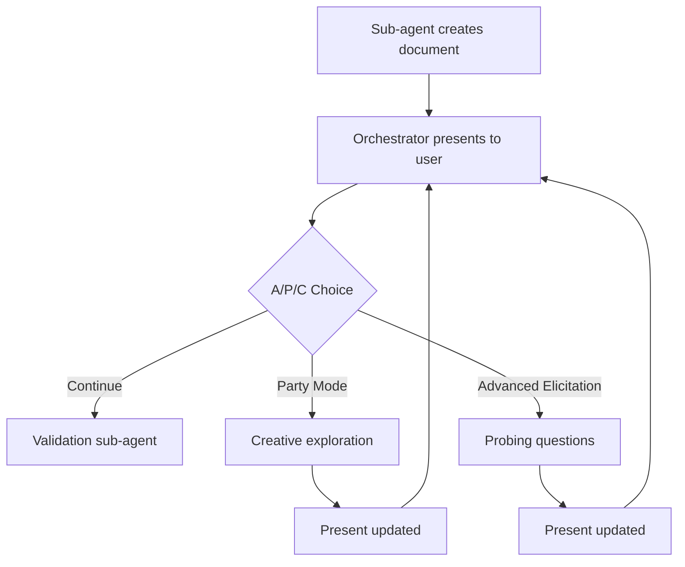

### Which Documents Get A/P/C

| Document | A/P/C? | Rationale |
|----------|--------|-----------|
| Product Brief (Phase 1) | Yes | Sets direction for entire project. |
| PRD (Phase 2) | Yes | Requirements gaps cause rework. |
| UX/UI Design (Phase 2) | Yes | Interaction gaps surface as surprises. |
| Architecture (Phase 3) | Yes | Wrong decisions affect every file. |
| Epics and Stories (Phase 3) | Yes | Story boundaries affect parallelisation and scope. |
| Phase 4 story files | No | Elaborated from already-approved epics. Story Validator catches gaps. |
| Quick Flow specs | No | Quick Flow is for fast tasks. A/P/C adds ceremony that defeats the purpose. |

### Embedded Elicitation

Before generating content for each document section, the orchestrator asks 2-3 lightweight clarifying questions about the user's intent. This captures thinking before the AI drafts, reducing the chance the A/P/C checkpoint becomes a rubber stamp. Example: "Before I draft authentication requirements: email/password, social OAuth, or both? Should sessions expire or stay alive? Is MFA in scope for MVP?"

---

## Phase Transition Protocol

When one phase completes and the next begins, the application (Bun sidecar) handles the transition:

1. **Validate.** Run the current phase's validation sub-agent. If validation fails, the user must resolve issues before advancing.
2. **Clean up.** Delete intermediate artifacts. Only canonical outputs survive.
3. **Store phase state.** The application records which phases are complete and their output file paths.
4. **Update system prompt.** The next phase's system prompt replaces the current one.
5. **Load inputs.** The next phase's orchestrator reads the previous phase's canonical output(s).
6. **Notify user.** The protocol chat shows a phase transition marker. The pre-flight checklist (green/yellow/red, advisory) confirms readiness.

**Trade-off: fresh context means no conversational continuity.** If the user discussed a nuance in Phase 1 that did not make it into the Product Brief, that nuance is gone in Phase 2. The orchestrator's gatekeeper role mitigates this: it ensures important context is captured in the output document before the phase completes.

**Pre-flight checklist is advisory, not blocking.** Blocking frustrates experienced users who understand the risks. Advisory respects user agency while making consequences visible.

### Phase State Machine

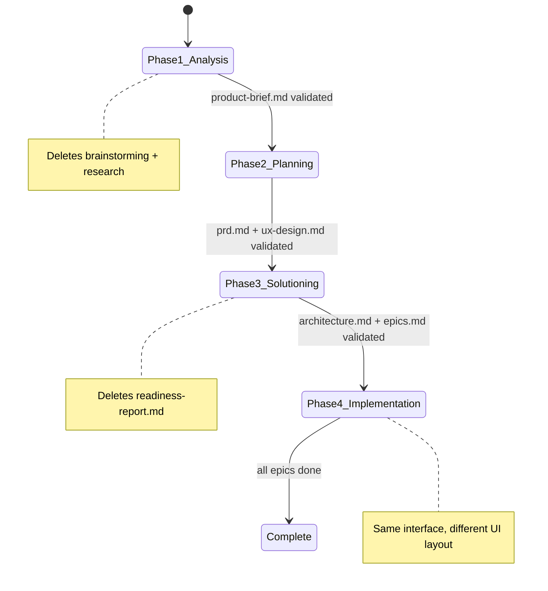

### Audit Trail

The system logs every phase transition, A/P/C choice, course correction, and spec update in LanceDB as structured records. The trail is queryable by phase, document, time range, and event type.

**What gets logged:**

| Event | Data Recorded |
|-------|--------------|
| A/P/C choice | Mode chosen (Continue/Party/AE/YOLO), document, section, timestamp. For Party Mode: additions selected. For AE: questions asked and answers given. For YOLO: sections auto-completed. |
| Phase transition | From-phase, to-phase, validation result (pass/fail/override), timestamp |
| Course correction | Scope (minor/moderate/major), what changed, who approved, readiness re-check result |
| Spec update | Artifact, section, change description, agent, reason |

**Three simultaneous purposes:**

1. **Product improvement** -- which A/P/C modes do users prefer? Where do they add the most value?
2. **Copyright defence** -- the trail creates a continuous chain of human editorial decisions. Each phase gate is evidence of "substantial human participation". Engagement strength: Advanced Elicitation (strongest) > Party Mode > Continue > YOLO (weakest, but still constitutes acceptance).
3. **EU AI Act compliance** -- an auditor can trace any planning artifact to the phase gate where a human approved it. Satisfies the transparency requirement (deadline: Aug 2, 2026).

---

## Dynamic Phase Entry

Not every project starts at Phase 1. Users who already have a PRD, who are joining an existing codebase, or who need a quick fix should enter at the appropriate phase.

| Entry Point | Requirements | Skipped | Notes |
|------------|-------------|---------|-------|
| Pre-phase (brownfield) | Existing codebase | Nothing | Runs codebase scan, generates `project-context.md`, then enters Phase 1 (or later) |
| Phase 1 | Nothing (start fresh) | Nothing | Default greenfield entry |
| Phase 2 | Product Brief (user provides or imports) | Phase 1 | Compatibility check validates brief has enough detail |
| Phase 3 | PRD + optional UX Design (user provides or imports) | Phases 1-2 | Compatibility check validates PRD meets FR contract requirements |
| Phase 4 | Architecture + Epics (user provides or imports) | Phases 1-3 | Readiness check runs automatically before implementation begins |
| Quick Flow | Existing codebase (brownfield only) | Phases 1-3 | Skips protocol. See Quick Flow section. Agent Barry handles spec + build. |

When entering at a later phase, the application validates the provided documents against the expected schema before allowing the phase to begin. A compatibility check sub-agent verifies imported documents contain enough detail for the target phase to work.

**Dynamic phase entry is a v0.5 feature.** MVP (v0.1-alpha through v0.2) requires sequential Phase 1 through Phase 4 for greenfield projects. Brownfield onboarding (pre-phase scan) ships at v0.1-alpha. Quick Flow ships at v0.1-beta.

---

## Controlled Evolution

Planning artifacts (Product Brief, PRD, Architecture, Epics) are living documents during implementation. Changes happen. The question is how to manage them without losing traceability.

### Minor Updates

Small corrections that do not affect story boundaries or architecture decisions. Examples: fixing a typo in an FR, clarifying an acceptance criterion, updating a library version number.

**Process:** The correcting agent (SM, PM, or Architect) makes the change and logs it to the blackboard with `type: spec-update-minor`. No course correction flow. No readiness re-check. The audit trail records what changed, who changed it, and when.

### Major Updates

Changes that affect story boundaries, architecture decisions, or FR scope. These always go through Course Correction (see Phase 4: Course Correction).

### Spec Update Audit Trail

Every change to a planning artifact is logged:

```yaml
- type: spec-update-minor
  artifact: architecture.md
  section: "Technology Decisions > Calendar Library"
  change: "Updated library X v2.1 to library Y v3.0"
  agent: architect
  reason: "Library X does not support recurring events"
  timestamp: 2026-02-11T23:15:00Z
```

This audit trail serves two purposes:
1. **Debugging** -- when a story fails, the trail shows whether a spec change caused the failure
2. **Copyright defence** -- every spec change is a documented human-approved decision (via the agent hierarchy), strengthening the "substantial human participation" chain

---

## Quick Flow

Quick Flow is the two-track protocol's fast path for bug fixes and small changes. It skips Phases 1-3 and drops directly into a simplified Phase 4.

### Interface Contracts

| Contract | Detail |
|----------|--------|
| **Entry point** | Free chat interface. User types a change request or selects "Quick Flow" from the project menu. |
| **Input** | User's natural language description of the change. For brownfield projects, `project-context.md` is loaded automatically (Quick Flow assumes the user knows the codebase, so no fresh scan runs). |
| **Output** | Modified code files with quality gates passed. No planning artifacts produced. Changes are committed to a branch. |
| **Agent** | Barry (Quick Flow Solo Dev). Handles spec generation, implementation, and code review in a single agent context. |
| **Scope boundary** | If the spec affects more than 3 files or touches more than 2 modules, the orchestrator recommends switching to the full protocol: "This change looks broad enough to benefit from the full protocol. Switch to Phase 1?" The user can override and stay in Quick Flow. |
| **Release target** | v0.1-beta |

### Workflow

```text
User selects "Quick Flow"
    |
    v
[Quick Spec] -- INTERACTIVE
    |              User describes the change in natural language
    |              Barry generates a mini-spec (not a full PRD)
    |              Covers: what to change, acceptance criteria,
    |              files likely affected
    |
    +-- [Scope check] -- AUTOMATIC
    |       If >3 files or >2 modules affected:
    |       "This change looks broad. Switch to full protocol?"
    |       User can override.
    |
    v
[Developer Agent] -- AUTOMATIC
    |                  Single agent (Barry), single worktree
    |                  No parallel execution
    |                  If spec is small: embedded in system prompt
    |                  (no reference document needed)
    |                  If spec is large: saved to disk, path passed
    |                  Quality gates still run
    |
    v
[Code Review] -- AUTOMATIC
    |              Same builder-validator pattern
    v
[Complete]
```

Quick Flow runs in the free chat interface. It does not use the protocol phase tabs. It does not produce planning artifacts. It does not run validation sub-agents beyond code review.

**Quick Flow is inherently brownfield.** Small changes to existing projects are the primary use case. If the project has a `project-context.md` from a previous scan, Quick Flow loads it to respect detected conventions. If no scan exists, Barry detects conventions from the files he touches.

---

## MCP Server Extension Point

CodeMAD exposes its protocol phases as MCP tools so external clients (Cursor, Claude Code, other MCP-capable tools) can invoke the CodeMAD Protocol without using the desktop app. This is the distribution mechanism for the methodology.

### Five Externally Invocable Phases

| MCP Tool | Maps To | Input | Output |
|----------|---------|-------|--------|
| `codemad/analyse` | Phase 1 (Analysis) | Project idea (text) + optional project directory path | Product Brief (markdown) |
| `codemad/plan` | Phase 2 (Planning) | Product Brief path | PRD (markdown) + optional UX Design (markdown) |
| `codemad/architect` | Phase 3 (Solutioning) | PRD path + optional UX Design path | Architecture (markdown) + Epics (markdown) |
| `codemad/implement` | Phase 4 (Implementation) | Architecture path + Epics path + project directory | Working code (files in worktree) |
| `codemad/quick` | Quick Flow | Change description (text) + project directory path | Modified code files |

### Context Provision Rule

External clients calling these tools must provide all required input documents. The MCP server does not have access to the calling client's conversation history. Each tool invocation runs with a fresh context, reading only the documents passed as input parameters.

**For brownfield projects:** External clients must pass the project directory path. The MCP server runs the codebase scan and generates `project-context.md` as part of the tool invocation.

### Input/Output Contracts

Each tool validates its inputs before execution:

```text
[MCP client calls codemad/architect]
    |
    v
[Validate inputs] -- Does PRD path exist? Is it a valid PRD?
    |
    +-- Invalid --> Return error with specific validation failure
    |
    +-- Valid --> [Run Phase 3 orchestrator]
                    |
                    v
                 [Return output paths + summary]
```

Tools return structured responses: output file paths, a human-readable summary, and a status (success, validation-failed, needs-human-input). Tools that require human interaction (A/P/C checkpoints) return a `needs-human-input` status with the pending question, and the external client must call the tool again with the user's response.

### Architecture Requirement

The MCP server runs inside the Bun sidecar alongside the desktop app. When the desktop app is running, MCP tools are available on a local socket. The architecture document must define whether the MCP server can run standalone (without the desktop UI) for headless use cases.

**Basic MCP server exposure ships at v0.3** (one protocol phase as MCP tool). Full exposure ships at v1.0.

---

## Cross-Phase Tools

Three tool categories are available at any time, independent of the current protocol phase.

### Adversarial Review

| Aspect | Detail |
|--------|--------|
| **Agent** | Uses the current phase's orchestrator with a review persona overlay |
| **Scope** | Any planning artifact, any code file, any section of any document |
| **Minimum findings** | 3 issues required (same severity classification as all validators) |
| **When to use** | User suspects a document has gaps or wants a "red team" pass before a phase gate. |

### Editorial Reviews

| Review Type | Focus | Agent |
|------------|-------|-------|
| **Prose review** | Clarity, readability, jargon, Year 6 reading level | Paige (Tech Writer) |
| **Structure review** | Heading hierarchy, cross-references, self-containment | Paige (Tech Writer) |

These produce reports. The user decides what to fix. No auto-repair loop.

### Help Routing

The application's phase navigation UI replaces BMAD's `/bmad-help`. The phase state machine determines which phases are complete, in progress, or locked. Within Phase 4, the Sprint Status Hub handles action routing. No user-facing help command is exposed.

---

## Implementation Considerations

### Application-Level Orchestration

The Bun sidecar manages the protocol, not an AI agent. This means:

- Phase state is stored in the project's `.codemad/` directory
- Phase transitions are deterministic application logic
- System prompt switching is a function call, not an agent decision
- Intermediate artifact cleanup is a file system operation
- The application enforces that Phase 2 cannot start until Phase 1's output is validated

This is important because it means the protocol is reliable. An AI agent might skip a phase or forget to validate. The application cannot -- the code enforces the sequence.

### System Prompt Architecture

Each phase needs a distinct system prompt that includes:

1. **Phase personality** (discovery / specification / architect / builder)
2. **Available sub-agents** (which agents can be spawned)
3. **Input documents** (what to read)
4. **Output specification** (what to produce)
5. **Quality criteria** (what "done" looks like)
6. **Constraints** (what the phase must NOT do -- Phase 4 must not make architecture decisions, Phase 2 must not write code)

The system prompts are not static text. The application assembles them from templates + project context + phase state. This allows the protocol to adapt to the project while maintaining the phase structure.

### MCP Tool Availability Per Phase

Not all MCP tools are needed in all phases. Lazy loading per phase reduces token cost.

| MCP Tool | Phase 1 | Phase 2 | Phase 3 | Phase 4 |
|----------|:-------:|:-------:|:-------:|:-------:|
| Web search | Yes | No | Yes | No |
| Context7 (library docs) | No | No | Yes | Yes |
| Semgrep (security scan) | No | No | Yes | Yes |
| LanceDB (code search) | No | No | Yes | Yes |
| LanceDB (memory) | Yes | Yes | Yes | Yes |
| Blackboard MCP | Yes | Yes | Yes | Yes |
| Git operations | No | No | No | Yes |
| File system | Yes | Yes | Yes | Yes |

---

## Workflow Execution Patterns

BMAD workflows use two execution patterns. CodeMAD's application layer must support both.

### Pattern A: Step-File Architecture (Phases 1-3)

Each workflow is a folder containing a `workflow.md` entry point and numbered step files. The application loads one step file at a time into the agent's context.

**Key characteristics:**
- **Just-in-time loading.** Only one step file is in memory at any time.
- **Sequential enforcement.** Steps cannot be skipped. The `stepsCompleted` frontmatter array tracks progress.
- **Append-only document building.** Each step appends content to the output document (except the PRD polish step).
- **User gates.** The A/P/C menu is available at each content-generating step.

### Pattern B: Workflow Engine (Phase 4)

Phase 4 workflows use `workflow.yaml` configuration files processed by the core `workflow.xml` execution engine.

**Key characteristics:**
- **Variable resolution.** The engine resolves `{output_folder}`, `{user_name}`, and other variables from `config.yaml`.
- **Smart file discovery.** Three strategies: `FULL_LOAD` (entire document), `SELECTIVE_LOAD` (specific sections by heading), `INDEX_GUIDED` (read index.md of sharded folder, then load specific sections).
- **Two execution modes.** Normal (interactive, with user checkpoints) and YOLO (automated, no pauses).

### Agent Statelessness

Each workflow step runs in a fresh context. State is persisted through three mechanisms:

1. **Document frontmatter** -- `stepsCompleted`, `inputDocuments`, `status` fields
2. `sprint-status.yaml` -- story lifecycle tracking for Phase 4
3. **Story files** -- Dev Agent Record, File List, and Change Log within each story file

The application reads these state files to determine which workflows are available and what state each one is in. Agent statelessness means any agent instance can pick up work from any state file -- there is no session affinity.

---

## Testing Integration

BMAD has three testing paths. CodeMAD makes this an explicit user choice in the desktop app, not an implicit pick-by-workflow decision.

### Three Testing Paths

| Path | When Tests Are Written | How It Works | Agent | Default? |
|------|----------------------|-------------|-------|----------|
| **Standard TDD** | During implementation | Per-task red-green-refactor within dev-story. Tests written by the dev agent as part of each task. | Amelia (Dev) | Yes (default) |
| **ATDD** (Acceptance Test-Driven Development) | Before implementation | TEA generates failing `test.skip()` tests from acceptance criteria BEFORE the dev agent starts. Dev agent implements to make tests pass. | Murat (TEA) + Amelia (Dev) | No (opt-in) |
| **Post-implementation** | After implementation | Tests generated after code is written to expand coverage. Catches edge cases the dev agent missed. | Quinn (QA) or Murat (TEA) | No (opt-in) |

### User Choice in the Desktop App

The user selects a testing path at project creation. The choice applies to all epics by default.

```text
Project Settings > Testing Strategy
    |
    +-- [Standard TDD] (default)
    |       Dev agent writes tests during each task.
    |       Lightweight. Fastest throughput.
    |
    +-- [ATDD]
    |       TEA generates failing tests before dev starts.
    |       Highest quality. Slower throughput.
    |       Requires TEA module.
    |
    +-- [Post-implementation]
            Dev agent writes code first, tests added after.
            Fastest code generation. Risk of undertesting.
```

**Per-epic override:** Users can change the testing path for individual epics. A payment processing epic might use ATDD for rigour while a documentation epic uses Standard TDD for speed.

### TEA Companion Document

When ATDD is selected, the TEA module produces companion documents alongside the standard protocol output:

| Phase | TEA Output | Purpose |
|-------|-----------|---------|
| Phase 3 | Test Framework Setup (TF) | Scaffold test infrastructure (Playwright/Cypress) |
| Phase 3 | Test Design - System Level (TD) | Testability review of architecture |
| Phase 3 | CI Setup (CI) | Quality pipeline configuration |
| Phase 4 (per epic) | Test Design - Epic Level (TD) | Per-epic risk and coverage plan |
| Phase 4 (per story) | ATDD Checklist | Failing tests as implementation roadmap |

**Full TEA path per story:** Test Design (TD) then ATDD (AT) then Dev-Story then Test Automation (TA) then Test Review (RV) then Traceability (TR).

**Standard TDD path per story:** Dev-Story (built-in TDD) then optionally Test Automation (TA).

### Testing Path Selection is a v0.5 Feature

At MVP (v0.1-alpha through v0.2), Standard TDD is the only available path. ATDD and post-implementation paths ship at v0.5 when the dynamic phase selector and TDD choice features are introduced.

---

## Design Decisions Log

Decisions resolved by Costa on 2026-02-11. Each decision is documented inline at its reference section.

| ID | Decision | Reference Section |
|----|----------|-------------------|
| RD1 | Fresh context per phase (not persistent) | Phase Transition Protocol |
| RD2 | Course correction via Architect sub-agent (developer never edits planning artifacts) | Phase 4: Key Design Decisions |
| RD3 | Pre-flight checklist is advisory (not blocking) | Phase Transition Protocol |
| RD4 | Default 3 parallel Story Developers (configurable) | Phase 4: Key Design Decisions |
| RD5 | Orchestrator mediates all agent access (gatekeeper pattern) | Information Flow |
| RD6 | Severity-based verification (consistent across all validators) | Severity-Based Verification |
| RD7 | Controlled evolution (specs are living documents) | Controlled Evolution |
| RD8 | Sprint Planning stays in Phase 4 (not Phase 3) | Phase 3: Key Design Decisions |
| RD9 | Full audit trail in LanceDB | Phase Transition Protocol: Audit Trail |
| RD10 | Testing path is explicit user choice | Testing Integration |
| RD11 | Pre-phase brownfield onboarding | Project Onboarding |
