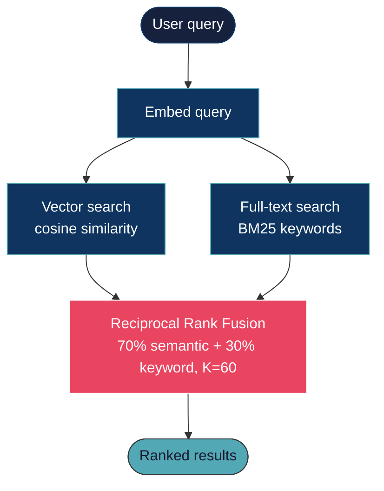
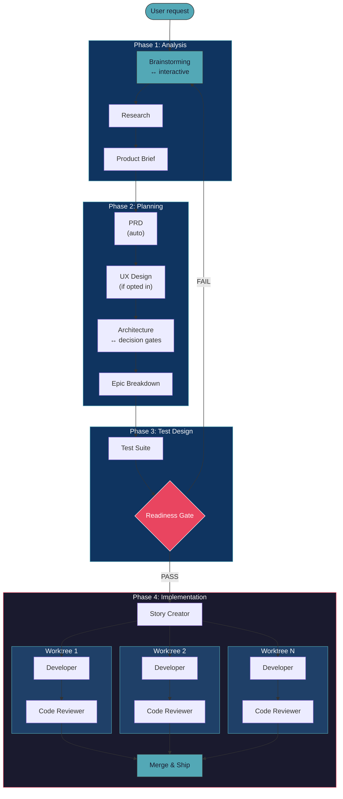

> **AI coding tools have a dirty secret:** they make you faster at writing code but slower at shipping products. You spend hours in context-switching hell, lose decisions between sessions, and watch AI-generated chaos multiply across your codebase.

**CodeMAD fixes this.** It's a desktop app -- the first AI coding platform with a methodology -- turning "vibe coding" into shipped features through structured workflows, persistent memory, and parallel execution.

## The Problem

You've experienced this:

- **Session amnesia** -- Every conversation starts fresh. "Didn't we already decide to use Zustand?"
- **Chaos multiplication** -- AI generates code fast, but without structure, you're just creating technical debt faster
- **Merge nightmare** -- Parallel work means conflicts. Manual resolution means lost productivity
- **Privacy anxiety** -- Your code goes through someone's proxy server. You hope they're trustworthy

**Result:** AI tools that promise 10x productivity deliver 2x with 5x cleanup.

<br />

## The Solution

CodeMAD introduces the **CodeMAD Protocol** -- a four-phase methodology that turns AI assistance into shipped products:

```
Analysis ──> Planning ──> Test Design ──> Implementation
    │           │              │                │
  Brainstorm  PRD, optional   Tests from      Code to pass
  research,   UX, architect,  architecture    tests, review,
  brief       breakdown       & stories       and ship
```

**This isn't just another AI coding tool. It's AI coding with structure -- brainstorm, plan, test, then build.**

<br />

---

## How CodeMAD Compares

| Capability                     | CodeMAD                     | CodeLayer     | Aider      | Claude Code     | Windsurf    | Continue.dev | Roo Code   |
| ------------------------------ | --------------------------- | ------------- | ---------- | --------------- | ----------- | ------------ | ---------- |
| **Multi-agent worktrees**      | Git-isolated                | Orchestration | No         | Sub-agents only | No          | No           | No         |
| **Automatic code indexing**    | LanceDB + AST               | No            | Repo map   | Manual          | Yes         | Yes          | Yes        |
| **Goal-backward verification** | CodeMAD Protocol            | No            | No         | No              | No          | No           | No         |
| **Chinese LLM support**        | Kimi, GLM, MiniMax          | No            | No         | No              | No          | No           | No         |
| **OAuth login**                | Anthropic PKCE              | No            | No         | No              | No          | No           | No         |
| **Privacy (direct API)**       | Yes                         | Yes           | Yes        | Yes             | No (Proxy)  | Yes          | Yes        |
| **Structured workflow**        | 4-phase protocol            | No            | No         | No              | No          | No           | No         |
| **Open source**                | MIT                         | MIT           | Apache     | Proprietary     | Proprietary | Apache       | Apache     |
| **Interface**                  | TUI + Web IDE + Desktop IDE | Desktop       | CLI        | CLI             | IDE         | VS Code      | VS Code    |
| **Pricing**                    | Free + API                  | Free + API    | Free + API | API usage       | $15-60/mo   | Free + API   | Free + API |

**Bottom line:** Other tools accelerate code generation. CodeMAD accelerates product delivery.

**The gap no one fills:** Every tool in this table handles one slice of the development pipeline. Aider edits files. Claude Code runs commands. Windsurf indexes code. CodeLayer orchestrates agents. None of them orchestrate the full pipeline -- plan → code → review → merge -- as a coordinated agent sequence. CodeMAD is the first tool that treats this entire pipeline as a single automated workflow, driven by the four-phase CodeMAD Protocol. That's why "structured workflow" is the row that matters most.

<br />

---

## Features

| Feature                      | Description                                                                  |
| ---------------------------- | ---------------------------------------------------------------------------- |
| Autonomous Tasks             | Describe your goal; agents handle planning, implementation, and validation   |
| Parallel Execution           | Run multiple builds simultaneously with up to 12 agent chats                |
| Isolated Workspaces          | All changes happen in git worktrees -- your main branch stays safe          |
| Self-Validating QA           | Built-in quality assurance loop catches issues before you review             |
| AI-Powered Merge             | Automatic conflict resolution when integrating back to main                  |
| Memory Layer                 | Agents retain insights across sessions for smarter builds                    |
| Semantic Code Search         | AST-aware vector search finds code by meaning, not just keywords             |
| Permission Modes             | Guardian, Balanced, or Autopilot -- one click to set agent autonomy level   |
| MCP Tool Extensibility       | Connect any MCP server for extra tools; lazy-loaded to save context          |
| OAuth Provider Auth          | Log in with your existing subscription -- no API keys to manage              |
| GitHub/GitLab Integration    | Import issues, investigate with AI, create merge requests                    |
| Linear Integration           | Sync tasks with Linear for team progress tracking                            |
| Cross-Platform               | Native desktop apps for Windows, macOS, and Linux                            |
| Auto-Updates                 | App updates automatically when new versions are released                     |

<br />

---

## Interface

### Kanban Board

Visual task management from planning through completion. Create tasks and monitor agent progress in real-time.

### Agent Chats

AI-powered chats with one-click task context injection. Spawn multiple agents for parallel work.

### Additional Features

- **Insights** -- Separate chat interface for exploring your indexed codebase through conversation
- **Ideation** -- Discover improvements, performance issues, and vulnerabilities
- **Changelog** -- Generate release notes from completed tasks

<br />

---

## How It Works

This section describes every major subsystem: what it does, how it works, and the design decisions behind it.

### Agent System

The agent system uses a **lead-plus-workers** pattern. One lead orchestrator delegates to specialised worker agents, each focused on a single concern.

**Design principles:**

| Principle | Implementation | Inspiration |
| --------- | -------------- | ----------- |
| Minimalism over complexity | 2-5 agents per task, never more | Claude Code scaled back from 20-30; mini-swe-agent achieves 74% SWE-bench in 100 lines |
| Builder + Validator pairing | Every story gets a Developer and a Code Reviewer | 2x compute buys trust that work was delivered correctly |
| Focused context windows | One agent, one story, one worktree | Smaller context produces better output than one agent juggling everything |
| Lead stays lean | Lead orchestrates, never implements. Target: under 120k tokens | Context bloat degrades reasoning quality |
| Hook-based lifecycle | 13 lifecycle events coordinate agent behaviour | Pre/post hooks for tool calls, session start/stop, validation gates |
| Self-validating agents | Stop hooks with exit code 2 force continuation if validation fails | Eliminates "it compiles but doesn't work" failure mode |

**Agent types:**

| Agent | Role | Runs In | Model Tier |
| ----- | ---- | ------- | ---------- |
| Lead Orchestrator | Brainstorms with user, delegates, monitors progress | Main directory | Highest (e.g. Claude Opus) |
| Research | Gathers market/tech context, validates constraints | Subagent | Low-tier (e.g. Claude Haiku) |
| Product Brief | Synthesises research into problem, users, MVP scope | Subagent | Mid-tier |
| PRD Creator | Auto-generates PRD from product brief | Subagent | Mid-tier |
| UX Designer | Creates UX spec when user opts in | Subagent | Mid-tier |
| Architect | Technical decisions, ADRs, asks user for key choices | Subagent | Mid-tier |
| Story Creator | Decomposes architecture into implementable stories | Subagent | Mid-tier |
| Test Designer | Creates test suites from architecture and stories | Subagent | Mid-tier |
| Developer | Implements code to pass pre-written tests | Git worktree | Mid-tier (e.g. Claude Sonnet) |
| Code Reviewer | Reviews, validates against tests, approves or requests changes | Same worktree | Mid-tier |

**Task list communication:** Parallel agents share a task list. Agents report completion, blocked tasks unblock automatically, and the lead reacts in real time. No polling -- event-driven coordination.

### Tool System

Tools are the agent's interface to the outside world. Each tool is a typed function with a Zod schema for arguments, a description for the LLM, and an execute function. Tools are registered at startup and available to any agent.

**Tool resolution order:**

| Priority | Source | Example |
| -------- | ------ | ------- |
| 1 | Built-in tools | `bash`, `read`, `edit`, `write` |
| 2 | MCP server tools | Any tool from connected MCP servers |
| 3 | Custom tools | User-defined tools in `tool/` directories |
| 4 | Skill tools | Registered skills invoked by name |

**Tool approval:** In Guardian mode, every tool call requires user approval. In Balanced mode, file tools auto-approve but bash requires approval. In Autopilot mode, all tools auto-approve within the sandbox boundary.

**Built-in tools:**

| Tool              | What It Does                                                              |
| ----------------- | ------------------------------------------------------------------------- |
| `bash`            | Run shell commands with timeout and working directory                     |
| `read`            | Read file contents with optional line range                               |
| `edit`            | Exact string replacement in files                                         |
| `write`           | Write entire file contents                                                |
| `glob`            | Fast file pattern matching (e.g., `**/*.ts`)                              |
| `grep`            | Content search using ripgrep-style patterns                               |
| `ls`              | List directory contents                                                   |
| `multiedit`       | Multiple edits to a single file in one call                               |
| `batch`           | Run multiple independent tool calls in parallel                           |
| `lsp`             | Language Server Protocol operations (go-to-definition, hover, references) |
| `task`            | Spawn a sub-agent for parallel work                                       |
| `webfetch`        | Fetch and process web content                                             |
| `websearch`       | Web search (conditional, feature-gated)                                   |
| `codesearch`      | Code search across the codebase                                           |
| `semantic_search` | Vector similarity search over indexed code                                |
| `apply_patch`     | Apply unified diff patches (GPT models only)                              |
| `question`        | Ask the user a question (build agent only)                                |
| `skill`           | Invoke a registered skill                                                 |
| `todo_write`      | Write to the TODO list                                                    |
| `todo_read`       | Read from the TODO list                                                   |
| `plan_enter`      | Switch to plan mode                                                       |
| `plan_exit`       | Exit plan mode                                                            |

### Semantic Code Search

The semantic code search system automatically indexes your codebase and lets you search by meaning, not just keywords.

**How indexing works, step by step:**

1. **File discovery.** The indexer scans the project directory, respecting `.gitignore` rules. It finds all source files and documentation files.

2. **AST-aware chunking.** The chunker uses [tree-sitter](https://tree-sitter.github.io/tree-sitter/) to parse source files into abstract syntax trees. It extracts semantically meaningful chunks -- functions, classes, methods, interfaces, type aliases -- rather than splitting on arbitrary line counts. Each chunk includes its symbol name, symbol type, start/end lines, and whether it contains comments.

   Supported languages for AST chunking:

   | Language   | Semantic Nodes Extracted                                               |
   | ---------- | ---------------------------------------------------------------------- |
   | TypeScript | Functions, classes, methods, interfaces, type aliases, arrow functions |
   | JavaScript | Functions, classes, methods, arrow functions, export statements        |
   | Python     | Functions, classes, decorated definitions                              |
   | Go         | Functions, methods, type declarations                                  |
   | Rust       | Functions, impl blocks, structs, enums, traits, modules                |
   | Java       | Methods, classes, interfaces, enums                                    |
   | C          | Functions, structs, enums                                              |
   | C++        | Functions, classes, namespaces, structs                                |
   | C#         | Methods, classes, interfaces, structs                                  |
   | Bash       | Functions, compound statements                                         |

   Documentation files (Markdown, etc.) use a simpler sliding-window chunker.

3. **Embedding.** The embedder converts each text chunk into a numeric vector. Three embedding tiers are available:

   | Tier   | Model                       | Dimensions | Accuracy (MTEB) | Requirements                     |
   | ------ | --------------------------- | ---------- | --------------- | -------------------------------- |
   | local  | gte-modernbert-base (149M)  | 768        | 64.38           | ~300MB download, 1GB RAM         |
   | voyage | Voyage Code 3 API           | 1024       | 79%             | API key, 200M tokens/month free  |
   | gemini | Google Gemini API           | 768        | 82%             | API key, 1,500 requests/day free |

   The local tier uses `@xenova/transformers` to run the ONNX-quantised gte-modernbert-base model directly in Bun. No external API needed. The model downloads on first use and is cached at `~/.cache/codemad/embeddings/`.

4. **Vector storage.** Embeddings are stored in [LanceDB](https://lancedb.github.io/lancedb/), a columnar vector database. The store supports both vector similarity search and full-text search (BM25). Index files live in `.codemad/index/` for git projects, or in `~/.cache/codemad/embeddings/<hash>` for other directories.

5. **Incremental re-indexing.** A file watcher monitors the project directory. When a file changes, only that file is re-chunked and re-embedded. When the embedding tier changes (e.g., switching from `local` to `voyage`), the store detects a dimension mismatch, clears the index, and triggers a full re-index.

6. **Hybrid search.** When you search (via `@codebase` syntax or the `semantic_search` tool), the system runs two searches in parallel:
   - **Vector search** -- finds chunks whose embeddings are closest to the query embedding (cosine similarity)
   - **Full-text search** -- BM25 keyword matching against chunk content

   Results are combined using **Reciprocal Rank Fusion** (RRF) with K=60: 70% weight on semantic results, 30% weight on keyword results. This produces better results than either method alone because semantic search catches synonyms and intent, while keyword search catches exact terms the embedding might miss.

**The search flow:**



### Provider Architecture

CodeMAD supports 20+ LLM providers through a layered loading system.

**How provider loading works:**

Providers are resolved in priority order. Each layer can add credentials or override options from the layer above:

| Priority | Layer            | Source                                | Example                                                      |
| -------- | ---------------- | ------------------------------------- | ------------------------------------------------------------ |
| 1        | Model database   | `models.dev` API fetch at startup     | Base model definitions, costs, limits                        |
| 2        | Environment vars | `ANTHROPIC_API_KEY`, `OPENAI_API_KEY` | Auto-detected from process.env                               |
| 3        | Auth store       | `~/.local/share/codemad/auth.json`    | Keys saved via `codemad auth <provider>`                     |
| 4        | Plugin loaders   | Registered auth plugins                | GitHub Copilot OAuth flow                                    |
| 5        | Custom loaders   | Provider-specific init code            | Provider-specific init (Bedrock regions, Vertex project IDs) |
| 6        | Config overrides | `codemad.json` provider section       | User model/option overrides                                  |

A provider only appears in the UI if at least one credential source is found. This means if you set `ANTHROPIC_API_KEY` in your environment, Anthropic models appear automatically with no config file needed.

**Bundled provider SDKs:**

| Provider        | SDK Package                  | Auth Method      |
| --------------- | ---------------------------- | ---------------- |
| Anthropic       | `@ai-sdk/anthropic`          | API key or OAuth |
| OpenAI          | `@ai-sdk/openai`             | API key or OAuth |
| Google          | `@ai-sdk/google`             | API key or OAuth |
| Zhipu (GLM)     | `zhipu-ai-provider`          | API key or OAuth |
| Moonshot (Kimi) | `@ai-sdk/openai-compatible`  | API key or OAuth |
| MiniMax         | `vercel-minimax-ai-provider` | API key or OAuth |
| Qwen            | `@ai-sdk/openai-compatible`  | API key or OAuth |

> **Goal:** Move all providers to OAuth so users never handle API keys directly.

**LLM streaming:**

All LLM communication flows through the Vercel AI SDK's `streamText` and `generateText` functions. Responses stream token-by-token to the UI via server-sent events (SSE). Tool calls interleave with text tokens -- the agent can start writing a response, call a tool mid-stream, and resume writing after the tool returns. Every streaming request carries an `AbortController` signal so the user can cancel at any time without leaving zombie requests.

### Session and Storage

Local-first, file-based storage. No server dependency for persistence.

| Aspect | Design |
| ------ | ------ |
| Format | JSON files with atomic writes and file locking |
| Location | `~/.local/share/codemad/storage/` |
| Session structure | One directory per session containing messages, tool calls, and metadata |
| Concurrent access | File locks prevent corruption when multiple agents write simultaneously |
| Migration | Version counter in `storage/migration` tracks schema changes. Delete counter to force re-migration. |
| Auth tokens | Stored with `0o600` permissions (owner-only read/write) |
| Offline operation | Everything works offline. No cloud sync. No remote dependency. |

### Permission System

Three permission modes control how much autonomy the agent has:

| Mode       | Edits | Terminal | Description                                      |
| ---------- | ----- | -------- | ------------------------------------------------ |
| Guardian   | Ask   | Ask      | Asks for approval on all edits and bash commands  |
| Balanced   | Auto  | Ask      | Auto-approves file edits, asks for terminal       |
| Autopilot  | Auto  | Auto     | Full autonomy, no approval needed                 |

Override the permission mode with a single click in the TUI. No config files needed.

**How permission resolution works:**

When an agent calls a tool, the permission system resolves in this order:

1. **Mode check** -- Is this tool type auto-approved in the current mode? (Guardian: nothing auto-approved. Balanced: file edits auto-approved. Autopilot: everything auto-approved.)
2. **Sandbox boundary check** -- Even in Autopilot, operations outside the project root are blocked. Agents cannot escape their workspace.
3. **User prompt** -- If the tool is not auto-approved and not blocked, the user is asked. One click to approve or deny.

This design reduces approval prompts by ~84% in Balanced mode while keeping destructive operations gated behind explicit consent.

### Git Worktree Isolation

Like agent teams from Anthropic, but each agent runs in a fully isolated filesystem. Everything happens automatically:

1. When a parallel agent is spawned, CodeMAD creates a new git worktree. This gives the agent its own working directory, HEAD, and index while sharing the `.git` object store with the main repo.

2. Each worktree gets a unique branch. The agent can modify, create, and delete files without affecting the main directory or other agents.

3. When the agent finishes, changes merge back automatically. Conflicts are resolved before merging.

### MCP Integration

CodeMAD implements the [Model Context Protocol](https://modelcontextprotocol.io/) client for extensible tool connectivity.

**Supported transports:**

| Transport       | Protocol                        | Use Case                    |
| --------------- | ------------------------------- | --------------------------- |
| stdio           | `StdioClientTransport`          | Local process (most common) |
| SSE             | `SSEClientTransport`            | Remote server (legacy)      |
| Streamable HTTP | `StreamableHTTPClientTransport` | Remote server (current)     |

**How MCP servers are configured:**

MCP servers are declared in `codemad.json`:

```json
{
  "mcp": {
    "my-server": {
      "type": "stdio",
      "command": "node",
      "args": ["my-mcp-server.js"]
    }
  }
}
```

At startup, CodeMAD connects to each configured MCP server, discovers its tools via the `tools/list` protocol method, and registers them as available tools in the agent's tool set. When the LLM invokes an MCP tool, CodeMAD proxies the call to the appropriate server via `tools/call`.

**MCP OAuth support:**

For remote MCP servers that require authentication, CodeMAD implements OAuth with PKCE. Tokens are stored and refreshed automatically.

**Tool change notifications:**

MCP servers can notify CodeMAD that their tool list has changed via `notifications/tools/list_changed`. When this happens, CodeMAD re-fetches the tool list and updates the agent's available tools mid-session.

**Automatic tool discovery:** The LLM detects when to use MCP tools automatically -- no manual invocation needed.

**Lazy loading:** MCP tool definitions are loaded on demand to minimise context window usage. Tools only occupy context when relevant to the current task.

### API Server

The API server is the bridge between the UI (web or desktop) and the agent system. It runs as a local HTTP server that both the TUI and Web IDE connect to.

**Server architecture:**

Built on [Hono](https://hono.dev/), a lightweight TypeScript web framework. The server runs on Bun's built-in HTTP server for maximum performance. In development, the TUI starts the server automatically. In production, the desktop app bundles the server as a background process.

**Route modules:**

| Route Group | Purpose |
| ----------- | ------- |
| `/sessions` | Create, list, and manage agent sessions |
| `/messages` | Send messages and receive agent responses |
| `/tools` | List available tools, invoke tools manually |
| `/models` | List available models and providers |
| `/config` | Read and update configuration |
| `/auth` | OAuth flows, token management |
| `/events` | SSE endpoint for real-time agent progress |

**Event streaming:**

The `/events` endpoint uses server-sent events (SSE) to push real-time updates to the UI. Events include: agent messages (token-by-token), tool calls and results, task status changes, and error notifications. The UI subscribes once and receives all updates for the active session.

**OpenAPI spec:**

Routes are defined with Zod schemas for both request and response types. The SDK is auto-generated from these schemas, so the TypeScript client stays in sync with the server without manual maintenance. Any schema change triggers SDK regeneration.

### Configuration Resolution

Configuration loads in layers. Each layer can override the one above.

| Priority | Source | Location | Example |
| -------- | ------ | -------- | ------- |
| 1 | Defaults | Built into the app | Default model, timeout values |
| 2 | Global config | `~/.config/codemad/config.json` | User's preferred provider, global MCP servers |
| 3 | Project config | `codemad.json` in project root | Project-specific models, MCP servers, agent settings |
| 4 | Environment variables | `.env` or shell | `ANTHROPIC_API_KEY`, `PORT` |

Project config overrides global. Env vars override both. This means a team can share `codemad.json` in the repo while each developer uses their own API keys via `.env` (gitignored).

<br />

---

## Architecture

**Tech stack:**

| Layer | Choice | Why |
| ----- | ------ | --- |
| Runtime | Bun | Fast startup, built-in test runner, native TypeScript |
| Monorepo | Bun workspaces + Turborepo | Bun-native, fast caching, minimal config |
| UI framework | SolidJS | Fine-grained reactivity, no virtual DOM overhead |
| Desktop | Tauri (Rust) | ~10x smaller binaries than Electron, lower memory, native performance |
| LLM SDK | Vercel AI SDK | Unified streaming API, provider abstraction, TypeScript-first |
| Vector DB | LanceDB | Columnar storage, built-in BM25 + vector search, no external server |
| API framework | Hono | Lightweight, fast, TypeScript-native |
| AST parsing | tree-sitter | Language-agnostic AST extraction, battle-tested |

**Package structure:**

| Package | Purpose | Key Dependencies |
| ------- | ------- | ---------------- |
| `opencode` | Core CLI, agent system, API server | `ai`, `hono`, `@lancedb/lancedb` |
| `app` | Web UI (SolidJS) | `solid-js`, `@solidjs/router` |
| `desktop` | Native desktop wrapper | `@tauri-apps/api` |
| `ui` | Shared UI components | `solid-js`, `tailwindcss` |
| `util` | Shared utilities | None (zero dependencies) |
| `plugin` | Plugin SDK | Minimal (types only) |
| `sdk` | Generated API client | Auto-generated from server schemas |
| `script` | Build and release tools | None |

**Dependency direction:** `desktop` → `app` → `ui`/`sdk` → `util`. `opencode` → `util`. Never import upward. The `sdk` package imports nothing -- it is auto-generated and consumed by `app`.

**Build order:** `util` → `ui` + `opencode` (parallel) → `sdk` → `app` → `desktop`. Turborepo handles ordering via `dependsOn` in `turbo.json` and caches by input hash.

<br />

---

## Configuration

### Provider Setup

**Option A: OAuth login (Anthropic or other)**

Log in with your Claude Max or Anthropic Console subscription directly from the app. No API key needed.

```bash
codemad auth anthropic
```

**Option B: API keys**

Set environment variables in `.env` (gitignored) or export them in your shell:

```bash
# .env (gitignored)
ANTHROPIC_API_KEY=sk-ant-...
OPENAI_API_KEY=sk-...
GOOGLE_API_KEY=AIza...
```

<br />

---

## Development

### Quality Gate

Every merge must pass five sequential gates:

| Gate | What it checks | Fails when |
| ---- | -------------- | ---------- |
| 1. Lint | ESLint rules, import order, formatting | Style violations, unused imports |
| 2. Type check | `tsc --noEmit` with strict mode | Type errors, missing null checks |
| 3. Build | Turborepo full build across all packages | Bundling failures, circular deps, missing exports |
| 4. Tests | `bun test` across all packages | Failing tests, coverage below threshold |
| 5. Review | Code reviewer agent approval (or human) | Unresolved change requests |

**Agent self-validation:** Before an agent reports a task as done, stop hooks run the first four gates automatically. If any gate fails (exit code 2), the agent continues working instead of reporting completion. This eliminates the "it compiles but doesn't work" failure mode.

**Phase 3 readiness gate:** Before implementation begins, the readiness gate checks that architecture decisions, epic breakdown, and acceptance criteria are complete. Result: PASS (proceed), CONCERNS (proceed with caveats), or FAIL (loop back to analysis).

### TypeScript Configuration (for coding standards)

| Flag                         | Effect                                                    |
| ---------------------------- | --------------------------------------------------------- |
| `strict: true`               | Enables all strict checks                                 |
| `noUncheckedIndexedAccess`   | Array/object access returns `T \| undefined`              |
| `noImplicitOverride`         | Requires `override` keyword on overridden methods         |
| `exactOptionalPropertyTypes` | Distinguishes `undefined` from missing property           |

<br />

---

## Roadmap

### MVP Core

| Feature              | Priority | Description                                                          |
| -------------------- | -------- | -------------------------------------------------------------------- |
| Context Intelligence | First    | LanceDB vector search, tree-sitter AST, @-syntax agent resolution   |
| Parallel Execution   | Second   | Automatic git worktree multi-agent orchestration                     |
| Code Review          | Third    | Per-hunk approval workflow                                           |

### Framework

Merges the [Bmad method](https://github.com/bmadcode/BMAD-METHOD) ([workflow map](https://docs.bmad-method.org/reference/workflow-map/)) with [Get Shit Done](https://github.com/gsd-build/get-shit-done) (GSD). From Bmad: structured four-phase methodology, story pipeline, context engineering. From GSD: interactive discussion gates, test-first verification, fresh-context execution. One lead agent per phase with subagents for each concern. The workflow starts with interactive brainstorming, runs automatically through planning with decision checkpoints at key moments, designs tests before implementation, then executes in parallel worktrees where developers code to pass pre-written tests. Each subagent searches the Bmad method docs for context before acting, preventing context rot across the pipeline.



All four phases are managed by the **Lead Orchestrator** (under 120k tokens). The workflow starts with interactive brainstorming, asks for user preferences (including whether UX design is needed), then runs automatically through research, planning, and test design. Architecture pauses for important decisions like tech stack and design preferences. Tests are written before implementation. Phase 4 fans out into parallel worktrees where developers code to pass the pre-written tests.

**Phase 1: Analysis** (interactive start, then automatic)

| Step | Agent | Output | Inspiration |
| ---- | ----- | ------ | ----------- |
| 1 | Lead Orchestrator (interactive) | Goals, constraints, scope decisions, UX preference | GSD `discuss` |
| 2 | Research | Market/technical validation, constraints | Bmad `research` |
| 3 | Product Brief | Problem statement, target users, MVP scope | Bmad `create-product-brief` |

Brainstorming is interactive -- the user discusses ideas, goals, and constraints with the Lead Orchestrator. The user is also asked whether UX design is needed (stored for Phase 2). Research only begins once brainstorming decisions are locked. Research results are fed to the orchestrator, which hands them to the Product Brief agent.

**Phase 2: Planning** (automatic with decision checkpoints)

| Step | Agent | Output | Inspiration |
| ---- | ----- | ------ | ----------- |
| 1 | PRD Creator | PRD with functional/non-functional specs, personas, risks | Bmad `create-prd` |
| 2 | UX Designer (conditional) | UX spec -- skipped if user opted out during brainstorming | Bmad `create-ux-design` |
| 3 | Architect | Technical decisions, ADRs, system design | Bmad `create-architecture` |
| 4 | Story Creator | Epics decomposed into implementable stories | Bmad `create-epics-and-stories` |

PRD is auto-created from the product brief. UX design runs only if the user opted in during Phase 1. Architecture runs automatically but pauses to ask the user about important decisions -- tech stack, architecture preferences, and other choices that shape implementation. Epic breakdown follows immediately after.

**Phase 3: Test Design** (automatic)

| Step | Agent | Output | Inspiration |
| ---- | ----- | ------ | ----------- |
| 1 | Test Designer | Test suites based on architecture decisions and stories | GSD `verify` |
| 2 | Readiness Gate | PASS / CONCERNS / FAIL decision before execution | Bmad `check-implementation-readiness` |

Tests are written before any implementation code exists. The Test Designer creates test suites that validate acceptance criteria from the stories against the architecture decisions. The Readiness Gate verifies that architecture, stories, and tests are coherent before starting implementation.

**Phase 4: Implementation** (parallel worktrees)

| Step | Agent | Mode | Output | Inspiration |
| ---- | ----- | ---- | ------ | ----------- |
| 1 | Developer | Parallel worktree per story | Code that passes pre-written tests | GSD `execute` + Bmad `dev-story` |
| 2 | Code Reviewer | Per story, after dev | Approval or change requests, cleanup | Bmad `code-review` |

Each story runs in its own git worktree. The developer implements code to pass the pre-written tests from Phase 3. The code reviewer validates the implementation, runs the quality gate, and works with the developer to clean up and ship the feature. Stories within the same epic run in parallel when they have no dependencies.

**Orchestration principles:**

| Principle | How it works |
| --------- | ------------ |
| Interactive alignment | Brainstorming captures user intent before automation begins. Architecture pauses for key decisions like tech stack and design preferences. |
| Test-first design | Tests are written from architecture and stories before implementation. Developers code to pass pre-written tests. No "it compiles but doesn't work." |
| Template meta prompts | Phases 1-3 produce a structured plan that becomes the execution spec for Phase 4. The plan is a prompt that builds prompts for each story agent. |
| Builder + Validator pairing | Every story gets a developer and a code reviewer. 2x compute buys trust that work was delivered correctly. |
| Self-validating agents | Stop hooks with exit code 2 force continuation if validation fails. Eliminates false completions. |
| Task list communication | Parallel worktree agents share a task list. Event-driven coordination -- no polling. |
| Focused context windows | One agent, one story, one worktree. Fresh context produces better output than one agent juggling everything. |
| Lead orchestrator stays lean | Plans and delegates, never implements. Target: under 120k tokens. |

**References:**

- [Bmad method](https://github.com/bmadcode/BMAD-METHOD) -- four-phase methodology, story pipeline, context engineering
- [Get Shit Done (GSD)](https://github.com/gsd-build/get-shit-done) -- interactive discussion gates, atomic task planning, fresh-context execution, spot-checking verification
- [Claude Code Hooks Mastery](https://github.com/disler/claude-code-hooks-mastery) -- hook-based orchestration, meta-agents, builder/validator team pattern, subagent lifecycle tracking
- [Auto-Claude](https://github.com/AndyMik90/Auto-Claude) -- autonomous multi-agent framework with 12 concurrent worktree agents, three-layer security, AI merge conflict resolution, GitHub/GitLab/Linear integration
- [Traycer](https://traycer.ai/) -- automated code review and testing workflows
- [memU](https://github.com/NevaMind-AI/memU) -- hierarchical memory framework for proactive AI agents; treats memory like a file system with structured categories, items, and resources. Potential contender for CodeMAD's cross-session memory layer.

<br />

---

## Security

Defence-in-depth with six layers. Each layer operates independently so a breach in one does not compromise the others.

| Layer | Control | How it works |
| ----- | ------- | ------------ |
| OS sandbox | Process isolation | macOS: seatbelt profiles restrict syscalls. Linux: bubblewrap (same approach as Claude Code). Bash commands run in a sandboxed child process. |
| Filesystem | Project-scoped access | Agents read and write only within the project root and their assigned worktrees. Access outside this boundary is blocked at the OS level, not just by application logic. |
| Network | Egress control | Block connections to private IP ranges (SSRF defence). Allow only known provider API endpoints. Prevents agents from exfiltrating data or hitting internal services. |
| Configuration | Self-modification prevention | Agents cannot modify their own config files, hooks, permission settings, or sandbox rules. A compromised agent cannot escalate its own privileges. |
| Secrets | Injection pattern | API keys are injected at runtime via environment variables. Keys are never written to disk inside worktrees. Auth tokens stored with `0o600` permissions (owner-only). |
| Resources | Compute limits | Per-agent timeout prevents runaway processes. Memory ceiling prevents a single agent from exhausting the system. Max file size for edits prevents accidental writes of large blobs. |

**How permission modes map to the security model:**

| Mode | File edits | Terminal commands | Sandbox boundary |
| ---- | ---------- | ----------------- | ---------------- |
| Guardian | Ask every time | Ask every time | Enforced |
| Balanced | Auto-approve | Ask every time | Enforced |
| Autopilot | Auto-approve | Auto-approve | Enforced |

Even in Autopilot mode, the sandbox boundary is always enforced. Full autonomy means "do anything within the sandbox," not "do anything on the machine."

**Release security:**

- Scanned with VirusTotal before publishing
- SHA256 checksums included for verification
- Code-signed where applicable (macOS)

<br />

---

## Troubleshooting

| Symptom                       | Cause                          | Fix                                                                |
| ----------------------------- | ------------------------------ | ------------------------------------------------------------------ |
| Port 4096 in use              | Another server running         | `lsof -i :4096` then kill, or `PORT=4097 bun dev serve`            |
| `ANTHROPIC_API_KEY not found` | Missing .env                   | Create `.env` with your API key                                    |
| TypeScript errors after pull  | Stale Turborepo cache          | `bun turbo --force`                                                |
| Types outdated after edit     | Bun file watcher missed change | Restart `bun dev`                                                  |
| Desktop app won't build       | Missing Rust toolchain         | `curl --proto '=https' --tlsv1.2 -sSf https://sh.rustup.rs \| sh`  |
| Desktop window blank          | Frontend not built             | `bun run --cwd packages/app build` first                           |
| Data corruption               | Corrupted local storage        | Delete `~/.local/share/codemad/storage/migration` to retry         |
| Provider not appearing        | No credentials found           | Set env var or run `codemad auth <provider>`                       |
| SDK type errors at runtime    | SDK out of sync with server    | Run `./packages/sdk/js/script/build.ts` to regenerate              |
| Models not loading            | Models.dev fetch disabled      | Unset `CODEMAD_DISABLE_MODELS_FETCH` or provide models via config  |
| Index not working             | Embedder failed to load        | Check logs. Ensure 1.5GB RAM available for local tier.             |

<br />

---

## FAQ

<details>
<summary><strong>How is privacy actually handled?</strong></summary>

**Zero proxy servers.** API calls go directly from your machine to your chosen provider. Sessions are stored locally as JSON files with file locking in `~/.local/share/codemad/storage/`. No telemetry. No data harvesting. Auth tokens are stored with `0o600` permissions (owner-only). For complete privacy, use Ollama or LMStudio for fully offline operation -- zero API calls leave your machine.

</details>

<details>
<summary><strong>Why Tauri instead of Electron?</strong></summary>

Tauri produces ~10x smaller binaries (50MB vs 500MB), uses native webviews instead of bundled Chromium, and has significantly lower memory footprint. The tradeoff is requiring Rust for desktop development. The Web IDE provides the same experience in a browser without Rust. Tauri 2.x also provides a capability-based permission system that restricts what the app can access on the host OS.

</details>

<details>
<summary><strong>What does it cost?</strong></summary>

**CodeMAD is free and open source (MIT license).** You pay only for LLM API usage based on your provider's pricing. You can log in with your existing Claude Max or Anthropic Console subscription via OAuth. Running local models via Ollama has zero API cost. The semantic search indexer runs a local embedding model by default (gte-modernbert-base), so indexing is also free.

</details>

<details>
<summary><strong>How does semantic code search work?</strong></summary>

On startup, CodeMAD indexes your codebase by: (1) scanning files respecting `.gitignore`, (2) parsing source files into AST-aware chunks using tree-sitter (extracting functions, classes, methods rather than arbitrary line splits), (3) converting each chunk into a 768-dimensional vector using the gte-modernbert-base local model, and (4) storing vectors in LanceDB. When you search, the query is embedded into the same vector space. Two parallel searches run -- vector similarity and BM25 keyword matching -- and results are fused using Reciprocal Rank Fusion (70% semantic, 30% keyword, K=60). File changes trigger incremental re-indexing via a file watcher.

</details>

<details>
<summary><strong>What makes the CodeMAD Protocol different from just prompting?</strong></summary>

The CodeMAD Protocol is a methodology, not a prompt. It structures AI work into four phases: **Analysis** (brainstorm interactively with the user, then research and brief), **Planning** (auto-create PRD, optional UX design, architect with decision checkpoints for tech stack and key choices, break into stories), **Test Design** (write tests from architecture before any code exists), **Implementation** (parallel agents in isolated git worktrees code to pass pre-written tests, then review and ship). The interactive brainstorming phase, inspired by GSD's "discuss" concept, ensures user intent is captured before automation begins. Tests written before code mean "done" is defined by passing tests, not by code existing.

</details>

<details>
<summary><strong>How do parallel agents work?</strong></summary>

Each parallel agent runs in an isolated git worktree -- a separate working directory with its own branch that shares the git object store with the main repo. This provides true filesystem isolation: agents can modify, create, and delete files without conflicts. Each agent gets a fresh context window (up to 200k tokens depending on the model). When an agent finishes, its changes merge back. The `task` tool spawns sub-agents, and the `batch` tool runs multiple independent tool calls in parallel within a single agent.

</details>

<details>
<summary><strong>What languages does the code indexer support?</strong></summary>

Tree-sitter AST-aware chunking supports TypeScript, JavaScript, Python, Go, Rust, Java, C, C++, C#, and Bash. Files in other languages are chunked using a simpler sliding-window approach. Documentation files (Markdown, etc.) are indexed with a docs-specific chunker. The embedding model (gte-modernbert-base) produces language-agnostic vectors, so semantic search works across all file types.

</details>

<details>
<summary><strong>Can I use multiple providers in the same session?</strong></summary>

Yes. You can switch models mid-conversation without losing context. You can also configure different agents to use different providers -- for example, use Claude for the main `build` agent and a cheaper model for the `explore` sub-agent. Set this in `codemad.json` under the agent's `model` field.

</details>

<details>
<summary><strong>How do I add a custom tool?</strong></summary>

Create a `.ts` or `.js` file in a `tool/` or `tools/` directory within any config directory (project root, `~/.config/codemad/`, or `.codemad/`). Export a `ToolDefinition` object with `description`, `args` (Zod schema), and `execute` function. The tool is discovered automatically at startup. Alternatively, use the plugin system or connect an MCP server.

</details>

<details>
<summary><strong>What does it cost per task?</strong></summary>

CodeMAD itself is free. You pay your LLM provider based on token usage. Approximate cost per task by model tier:

| Model | Approximate cost per task | Best for |
| ----- | ------------------------- | -------- |
| Claude Opus | ~$0.72 | Lead orchestration, complex reasoning |
| Claude Sonnet | ~$0.15-0.30 | Implementation (developer agents) |
| Claude Haiku | ~$0.03-0.05 | Research, code review, exploration |
| Gemini Pro | ~$0.46 | Cost-effective alternative for implementation |
| Local (Ollama) | $0.00 | Fully offline, zero API cost |

CodeMAD's tiered model assignment (Opus for lead, Sonnet for building, Haiku for review) keeps costs lower than running everything on the most expensive model.

</details>

<details>
<summary><strong>Why does every story get two agents instead of one?</strong></summary>

Because errors compound. If a single agent is 99% accurate per step, a 20-step task has only an 82% chance of being fully correct. At 95% accuracy per step, that drops to 36%. The builder+validator pattern catches mistakes the builder misses. The code reviewer agent runs the quality gate (lint, types, build, tests) and reviews the diff for logic errors before reporting the story as done. This costs 2x the compute but delivers work you can actually trust.

</details>

<br />

---

## Contributing

We welcome contributions at every experience level.

### Quick Path

1. **Find an issue** -- Check [issues](https://github.com/costa-marcello/codemad/issues) or the [roadmap](#roadmap) for contribution opportunities
2. **Fork and branch** -- `git checkout -b feat/your-feature`
3. **Code** -- Follow the project's code style conventions. Match existing patterns in the codebase.
4. **Verify** -- `bun check` must pass with 0 errors
5. **PR** -- Use conventional commits (`feat:`, `fix:`, `docs:`, `refactor:`, `test:`, `chore:`)

### Quality Standards

- TypeScript strict mode with `noUncheckedIndexedAccess: true`
- 70% test coverage baseline (100% for auth, payments, and data mutations)
- No `any` type -- use `unknown` with narrowing
- Pre-commit hooks enforce lint + format on staged files

### Commit Conventions

| Prefix      | Use When                              | Example                                |
| ----------- | ------------------------------------- | -------------------------------------- |
| `feat:`     | New user-facing functionality         | `feat(app): add dark mode toggle`      |
| `fix:`      | Bug fixes                             | `fix(opencode): handle empty response` |
| `docs:`     | Documentation only                    | `docs: update API examples`            |
| `chore:`    | Maintenance, deps, config             | `chore: bump typescript to 5.4`        |
| `refactor:` | Code changes without behaviour change | `refactor(util): simplify retry logic` |
| `test:`     | Adding or fixing tests                | `test(sdk): add timeout edge cases`    |

### High-Impact Areas

- Multi-agent orchestration
- Cross-session memory
- Vector search optimisation
- Per-hunk review UX

<br />

---

<p align="center">
  <strong>Stop generating code. Start shipping products.</strong>
</p>

<p align="center">
  <a href="https://github.com/costa-marcello/codemad/stargazers">Star on GitHub</a> ·
  <a href="https://github.com/costa-marcello/codemad/issues">Report Bug</a> ·
  <a href="https://github.com/costa-marcello/codemad/issues">Request Feature</a>
</p>

<p align="center">
  <sub>MIT License · Built for developers who got tired of AI chaos</sub>
</p>
